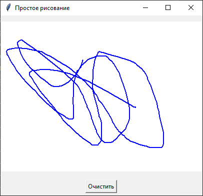
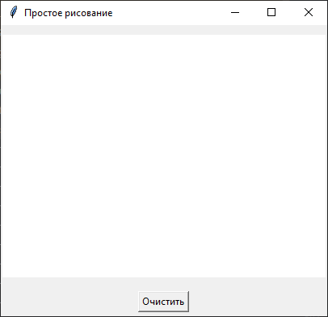
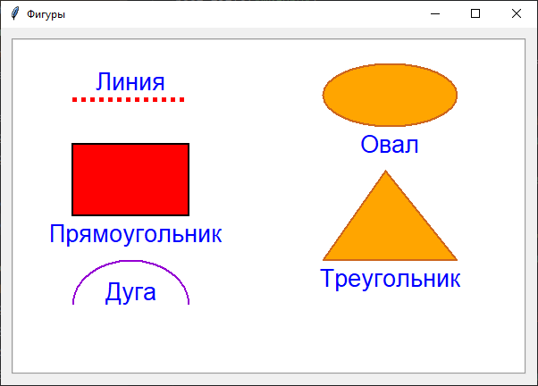
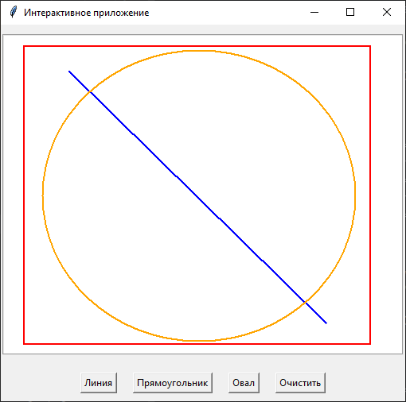

## [Рисование](#title0)
## [Фигуры](#title1)
## [Интерактивное приложение](#title2)

<br>
<br>

## <a id="title0">Пример 1: рисование - Canvas</a>

* <u>**Canvas**</u> = виджет, с помощью которого можно рисовать (прямоугольники, квадраты, круги и так далее).
* используется для создания пользовательских интерфейсов и простых игр.

Основные методы:

* **create_line(x1,y1,x2,y2, ...)** = рисует линию.
* **create_rectangle(x1,y1,x2,y2, ...)** = рисует прямоугольник.
* **create_oval(x1,y1,x2,y2, ...)** = рисует овал.
* **create_text(x,y,text)** = рисует текст.
* **create_image(x,y,image)** = рисует картинку.
* **bind(event, handler)** = привязывает обработчик к событию (к примеру, нажатию на кнопку мыши).

Пример: рисование с обработкой событий мыши.

1. Импорт библиотеки и создаём:
    * главное окно.
    * объект класса DrawingApp, передаём ему главное окно.
    * цикл событий.

```
import tkinter as tk

root = tk.Tk()
app = DrawingApp(root)
root.mainloop()
```
2. После импорта, создадим класс DrawingApp:
    * пропишем конструктор (в параметрах передаётся главное окно).
    * зададим заголовок окна.
    * создаём объект Canvas для рисования и делаем вертикальный отступ.
    * создаём 2 поля в классе, которые предназначены для хранения начальных координат при нажатии на кнопку мыши.
```
def __init__(self, master):
    self.master = master
    master.title("Рисование")
    
    self.canvas = tk.Canvas(master, width=400, height=300, bg="white")
    self.canvas.pack(pady=10)
    
    self.old_x = None
    self.old_y = None
```
3. Создаём **привязку событий**:
   + нажатие левой кнопки мыши.
       - **self.canvas.bind("<Button-1>", self.start_draw)** = метод является обработчик события.
       - **event.x(y)** = содержат координаты курсора мыши относительно виджета Сanvas.
       - **<Button-1>** = используется для начала рисование. Левая кнопка мыши.
   + перемещение при зажатой кнопке.
       - **self.canvas.bind("<B1-Motion>", self.draw)** = метод является обработчик события.
       - метод даём эффект непрерывного рисования.
       - **<B1-Motion>** = B1 указывает на кнопку, Motion - движение.
   + отпускание кнопки.
       - **self.canvas.bind("<ButtonRelease-1>", self.reset_coords)** = метод является обработчик события.
       - метод сбрасывает первоначальные координаты.
       - заканчиваем рисование при отпускании кнопки мыши.
       - **<ButtonRelease-1>** = для отпускание кнопки мыши.
```
self.canvas.bind("<Button-1>", self.start_draw)
 
self.canvas.bind("<B1-Motion>", self.draw) 
 
self.canvas.bind("<ButtonRelease-1>", self.reset_coords) 
```
4. Создаём методы привязки:
    * **event** = текущие координаты.
    * **capstyle = tk.ROUND** = скругленные концы линии.
    * **smooth=tk.TRUE** = сглаживание линии.
```
def start_draw(self, event):
    self.old_x = event.x
    self.old_y = event.y

def draw(self, event):
    if self.old_x and self.old_y:
        self.canvas.create_line(self.old_x, self.old_y, event.x, event.y, width=2, fill="blue", capstyle=tk.ROUND, smooth=tk.TRUE)
    self.old_x = event.x
    self.old_y = event.y

def reset_coords(self, event):
    self.old_x = None
    self.old_y = None
```
5. Создаём кнопку и метод (обработчик события), с помощью которого очистим всё окно.
```
self.clear_button = tk.Button(master, text="Очистить", command=self.clear_canvas)
self.clear_button.pack(pady=5)

def clear_canvas(self):
    self.canvas.delete("all")
```
Полный код:
```
import tkinter as tk
class DrawingApp:
    def __init__(self, master):
        self.master = master
        master.title("Простое рисование")

        self.canvas = tk.Canvas(master, width=400, height=300, bg="white")
        self.canvas.pack(pady=10)

        # Координаты для хранения начальных коо
        self.old_x = None
        self.old_y = None

        # Привязка событий мыши
        self.canvas.bind("<Button-1>", self.start_draw) # Нажатие левой кнопки мыши
        self.canvas.bind("<B1-Motion>", self.draw) # Перемещение мыши с зажатой левой кнопкой
        self.canvas.bind("<ButtonRelease-1>", self.reset_coords) # Отпускание левой кнопки мыши
        
        # Кнопка отчистки окна
        self.clear_button = tk.Button(master, text="Очистить", command=self.clear_canvas)
        self.clear_button.pack(pady=5)

    # Сохраняем начальные координаты при нажатии кнопки мыши
    def start_draw(self, event):
        self.old_x = event.x
        self.old_y = event.y

    # Рисуем линию от предыдущих координат до текущих
    def draw(self, event):
        if self.old_x and self.old_y:
            self.canvas.create_line(self.old_x, self.old_y, event.x, event.y, width=2, fill="blue", capstyle=tk.ROUND, smooth=tk.TRUE)
        self.old_x = event.x
        self.old_y = event.y

    # Сбрасываем координаты при отпускании кнопки мыши
    def reset_coords(self, event):
        self.old_x = None
        self.old_y = None

    # Очищаем Canvas (окно)
    def clear_canvas(self):
        self.canvas.delete("all")

root = tk.Tk()
app = DrawingApp(root)
root.mainloop()
```
Реализация:





<br>

## <a id="title1">Пример 2: фигуры - Canvas</a>

1. Создаем главное окно.
```
root = tk.Tk()
root.title("Фигуры")
root.geometry("600x400")
```
2. Создаём объект Canvas.
    * **relief** - желобок.
    * **bd**- ширина границы рамки.
```
canvas = tk.Canvas(root, width=580, height=380, bg="white", bd=2, relief="groove")
canvas.pack(pady=10, padx=10)
```
3. Линия и текст наж ней.
     * цвет красный.
     * **dash** = пунктирная. 1 аргумент - длина штриха. 2 аргумент - длина пробела между штрихами.
```
canvas.create_line(70, 70, 200, 70, fill="red", width=5, dash=(5,2))
canvas.create_text(135, 50, text="Линия", fill="blue", font=("Arial", 20))
```
4. Прямоугольник и текст под ним.
    * **fill="red"** = цвет фона.
    * **outline="blue"** = цвет сторон.
```
canvas.create_rectangle(70, 120, 200, 200, fill="red", outline="blue", width=2)
canvas.create_text(300, 160, text="Прямоугольник", fill="blue", font=("Arial", 20))
```
5. Овал и текст под ним.
```
canvas.create_oval(350, 30, 500, 100, fill="orange", outline="chocolate3", width=2)
canvas.create_text(425, 120, text="Овал", fill="blue", font=("Arial", 20))
```
6. Треугольник и текст под ним.
```
canvas.create_polygon(350, 250, 420, 150, 500, 250, fill="orange", outline="chocolate3", width=2)
canvas.create_text(425, 270, text="Треугольник", fill="blue", font=("Arial", 20))
```
7. Дуга и текст под ней.
    * **tk.ARC** = контур дуги.
    * **tk.PIESLICE** = закрашенный полукруг/полуовал.
    * **tk.CHORD** = как tk.PIESLICE, только выглядит уже, как замкнутая фигура.
    * **start, extent** = сколько градусов дуга.
```
canvas.create_arc(70, 250, 200, 350, start=0, extent=180, fill="purple", outline="darkviolet", width=2, style=tk.ARC)
canvas.create_text(135, 285, text="Дуга", fill="blue", font=("Arial", 20))
```
Полный код:
```
import tkinter as tk

root = tk.Tk()
root.title("Фигуры")
root.geometry("600x400")

canvas = tk.Canvas(root, width=580, height=380, bg="white", bd=2, relief="groove")
canvas.pack(pady=10, padx=10)

canvas.create_line(70, 70, 200, 70, fill="red", width=5, dash=(2,5))
canvas.create_text(135, 50, text="Линия", fill="blue", font=("Arial", 20))

canvas.create_rectangle(70, 120, 200, 200, fill="red", outline="black", width=2)
canvas.create_text(140, 220, text="Прямоугольник", fill="blue", font=("Arial", 20))

canvas.create_oval(350, 30, 500, 100, fill="orange", outline="chocolate3", width=2)
canvas.create_text(425, 120, text="Овал", fill="blue", font=("Arial", 20))

canvas.create_polygon(350, 250, 420, 150, 500, 250, fill="orange", outline="chocolate3", width=2)
canvas.create_text(425, 270, text="Треугольник", fill="blue", font=("Arial", 20))

canvas.create_arc(70, 250, 200, 350, start=0, extent=180, fill="purple", outline="darkviolet", width=2, style=tk.ARC)
canvas.create_text(135, 285, text="Дуга", fill="blue", font=("Arial", 20))

root.mainloop()
```
Результат:



<br>

## <a id="title2">Пример 3: интерактивное приложение - Canvas</a>


1. Создадим класс для интерактивного приложения.
    * передадим в конструкторе главное окно.
    * зададим главному окно заголовок.
```
def __init__(self, master):
    self.master=master
    master.title("Интерактивное приложение")
```
2. Создадим объект Canvas и добавим отступ.
```
self.canvas = tk.Canvas(master, width=500, height=400, bg="white", bd=2, relief="groove")
self.canvas.pack(pady=10)
```
3. Зададим начальные координаты (х, у).
```
self.start_x=None
self.start_y=None
```
4. Зададим текущую фигуру.
```
self.current_figure = "line"
```
5. Зададим текущую переменную для хранения ссылки на объект.
```
self.current_item = None
```
6. Привязка событий.
```
self.canvas.bind("<ButtonPress-1>", self.on_button_press)
self.canvas.bind("<B1-Motion>", self.on_mouse_drag)
self.canvas.bind("<ButtonRelease-1>", self.on_button_release)
```
7. Зададим панель инструментов:
    * фрейм с 4 кнопками.
```
frame = tk.Frame(master)
frame.pack(pady=10)

line = tk.Button(frame, text="Линия", command=lambda: self.set_tool("line"))
line.pack(side=tk.LEFT, padx=10)

rectangle = tk.Button(frame, text="Прямоугольник", command=lambda: self.set_tool("rectangle"))
rectangle.pack(side=tk.LEFT, padx=10)

oval = tk.Button(frame, text="Овал", command=lambda: self.set_tool("oval"))
oval.pack(side=tk.LEFT, padx=10)

btn = tk.Button(frame, text="Очистить", command=self.clear_canvas)
btn.pack(side=tk.LEFT, padx=10)
```
8. Обработчики событий. Методы:
    * удаляет всё, что в окне.
    * сохраняет текущий объект.
    * при нажатии на кнопку мыши, сохраняет текущие элементы и сбрасывает предыдущий объект.
    * при движении мыши рисует выбранную фигуру.
    * при отпускании кнопки.
```
def clear_canvas(self):
    self.canvas.delete("all")

def set_tool(self, figure):
    self.current_figure = figure

def on_button_press(self, event):
    self.start_x = event.x
    self.start_y = event.y
    self.current_item = None

def on_mouse_drag(self, event):
    # Проверка, если кнопка нажата из вне
    if self.start_x is None and self.start_y is None:
        return
    
    # Удаляем элемент предыдущий, чтобы нарисовать следующий.
    if self.current_item:
        self.canvas.delete(current_item)
    
    # Рисуем
    if self.current_figure == "line":
        self.current_item = self.canvas.create_line(self.start_x, self.start_y, event.x, event.y, fill="blue", width=2)
    elif self.current_figure == "rectangle":
        self.current_item = self.canvas.create_rectangle(self.start_x, self.start_y, event.x, event.y, outline="red", width=2)
    elif self.current_figure == "oval":
        self.current_item = self.canvas.create_oval(self.start_x, self.start_y, event.x, event.y, outline="orange", width=2)

def on_button_release(self, event):
    # Удаляем элемент предыдущий, чтобы нарисовать следующий.
    if self.current_item:
        self.canvas.delete(current_item)
    
    # Рисуем окончательный элемент
    if self.current_figure == "line":
        self.current_item = self.canvas.create_line(self.start_x, self.start_y, event.x, event.y, fill="blue", width=2)
    elif self.current_figure == "rectangle":
        self.current_item = self.canvas.create_rectangle(self.start_x, self.start_y, event.x, event.y, outline="red", width=2)
    elif self.current_figure == "oval":
        self.current_item = self.canvas.create_oval(self.start_x, self.start_y, event.x, event.y, outline="orange", width=2)
    
    self.start_x = None
    self.start_y = None
    self.current_item = None
```
9. Создаём главное окно, объект класса Interactive, цикл событий.
```
root = tk.Tk()
app = Interactive(root)
root.mainoop()
```
Полный код:
```
import tkinter as tk
class Interactive:
    def __init__(self, master):
        self.master = master
        master.title("Интерактивное приложение")

        self.canvas = tk.Canvas(master, width=500, height=400, bg="white", bd=2, relief="groove")
        self.canvas.pack(pady=10)

        self.start_x = None
        self.start_y = None

        self.current_figure = "line"

        self.current_item = None

        self.canvas.bind("<ButtonPress-1>", self.on_button_press)
        self.canvas.bind("<B1-Motion>", self.on_mouse_drag)
        self.canvas.bind("<ButtonRelease-1>", self.on_button_release)

        frame = tk.Frame(master)
        frame.pack(pady=10)

        line = tk.Button(frame, text="Линия", command=lambda: self.set_tool("line"))
        line.pack(side=tk.LEFT, padx=10)

        rectangle = tk.Button(frame, text="Прямоугольник", command=lambda: self.set_tool("rectangle"))
        rectangle.pack(side=tk.LEFT, padx=10)

        oval = tk.Button(frame, text="Овал", command=lambda: self.set_tool("oval"))
        oval.pack(side=tk.LEFT, padx=10)

        btn = tk.Button(frame, text="Очистить", command=self.clear_canvas)
        btn.pack(side=tk.LEFT, padx=10)

    def clear_canvas(self):
        self.canvas.delete("all")

    def set_tool(self, figure):
        self.current_figure = figure

    def on_button_press(self, event):
        self.start_x = event.x
        self.start_y = event.y
        self.current_item = None

    def on_mouse_drag(self, event):
        # Проверка, если кнопка нажата из вне
        if self.start_x is None and self.start_y is None:
            return

        # Удаляем элемент предыдущий, чтобы нарисовать следующий.
        if self.current_item:
            self.canvas.delete(self.current_item)

        # Рисуем
        if self.current_figure == "line":
            self.current_item = self.canvas.create_line(self.start_x, self.start_y, event.x, event.y, fill="blue", width=2)
        elif self.current_figure == "rectangle":
            self.current_item = self.canvas.create_rectangle(self.start_x, self.start_y, event.x, event.y, outline="red", width=2)
        elif self.current_figure == "oval":
            self.current_item = self.canvas.create_oval(self.start_x, self.start_y, event.x, event.y, outline="orange", width=2)

    def on_button_release(self, event):
        # Удаляем элемент предыдущий, чтобы нарисовать следующий.
        if self.current_item:
            self.canvas.delete(self.current_item)

        # Рисуем окончательный элемент
        if self.current_figure == "line":
            self.current_item = self.canvas.create_line(self.start_x, self.start_y, event.x, event.y, fill="blue",width=2)
        elif self.current_figure == "rectangle":
            self.current_item = self.canvas.create_rectangle(self.start_x, self.start_y, event.x, event.y, outline="red", width=2)
        elif self.current_figure == "oval":
            self.current_item = self.canvas.create_oval(self.start_x, self.start_y, event.x, event.y, outline="orange", width=2)

        self.start_x = None
        self.start_y = None
        self.current_item = None

root = tk.Tk()
app = Interactive(root)
root.mainloop()
```
Результат:



<br>