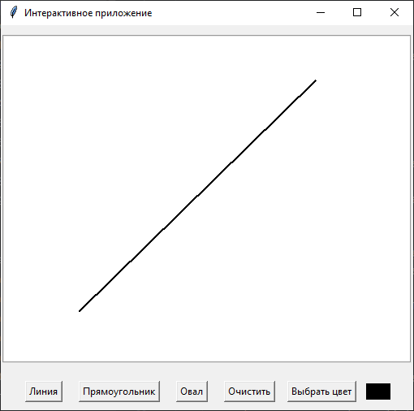
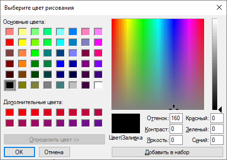
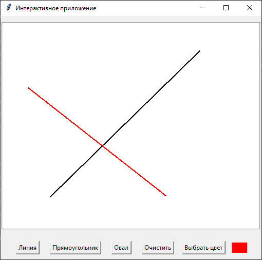
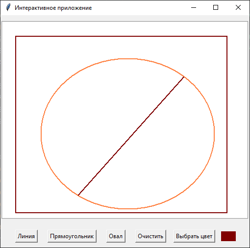

## Задание

### Графический редактор с инструментами (Canvas + Стратегия)

Расширьте пример интерактивного рисования на Canvas, используя паттерн "Стратегия" для управления инструментами рисования.
1. Создайте интерфейс DrawingToolStrategy с методом draw(canvas, start_x, start_y, end_x, end_y, **kwargs).
2. Реализуйте конкретные стратегии для каждого инструмента:
     * LineTool 
     * RectangleTool
     * OvalTool
Каждая стратегия должна инкапсулировать логику рисования соответствующей фигуры на Canvas.
3. В классе приложения DrawingApp храните ссылку на текущую стратегию инструмента. При выборе нового инструмента (например, через кнопки), меняйте стратегию.
4. Методы on_mouse_drag и on_button_release должны вызывать метод  draw  текущей стратегии.
5. Добавьте возможность выбора цвета рисования (например, с помощью tk.colorchooser.askcolor()).

## Решение

1. Создать стратегию.
```
class DrawingToolStrategy(abc.ABC):
    def draw(self, canvas, start_x, start_y, end_x, end_y, **kwargs):
        pass
```
2. Конкретные стратегии: рисуют линия, прямоугольник, овал.
```
class LineTool(DrawingToolStrategy):
    def draw(self, canvas, start_x, start_y, end_x, end_y, **kwargs):
        color = kwargs.get('color', 'blue')
        return canvas.create_line(start_x, start_y, end_x, end_y, fill=color, width=2)

class RectangleTool(DrawingToolStrategy):
    def draw(self, canvas, start_x, start_y, end_x, end_y, **kwargs):
        color = kwargs.get('color', 'red')
        return canvas.create_rectangle(start_x, start_y, end_x, end_y, outline=color, width=2)

class OvalTool(DrawingToolStrategy):
    def draw(self, canvas, start_x, start_y, end_x, end_y, **kwargs):
        color = kwargs.get('color', 'orange')
        return canvas.create_oval(start_x, start_y, end_x, end_y, outline=color, width=2)
```
3. Контекст:

+ Создаём объект Canvas для рисования.

Привязка событий:
   + нажатие левой кнопки мыши.
       - **self.canvas.bind("<Button-1>", on_button_press)** = метод является обработчик события.
       - **event.x(y)** = содержат координаты курсора мыши относительно виджета Сanvas.
       - **<Button-1>** = используется для начала рисование. Левая кнопка мыши.
   + перемещение при зажатой кнопке.
       - **self.canvas.bind("<B1-Motion>", on_mouse_drag)** = метод является обработчик события.
       - метод даём эффект непрерывного рисования.
       - **<B1-Motion>** = B1 указывает на кнопку, Motion - движение.
   + отпускание кнопки.
       - **self.canvas.bind("<ButtonRelease-1>", on_button_release)** = метод является обработчик события.
       - метод сбрасывает первоначальные координаты.
       - заканчиваем рисование при отпускании кнопки мыши.
       - **<ButtonRelease-1>** = для отпускание кнопки мыши.

**start_x**, **start_y** = для хранения начальных координат при нажатии на кнопку мыши.
**current_item** = текущий объект.
**current_color** = какой цвет.

Создаём кнопки фигур и другие, а также обработчики (некоторые прокомментированы).
```
class DrawingApp:
    def __init__(self, master):
        self.master = master
        master.title("Интерактивное приложение")

        self.canvas = tk.Canvas(master, width=500, height=400, bg="white", bd=2, relief="groove")
        self.canvas.pack(pady=10)

        self.start_x = None
        self.start_y = None

        self.strategy = LineTool() # Стратегия по умолчанию
        self.current_color = 'black'
        self.current_item = None

        self.canvas.bind("<ButtonPress-1>", self.on_button_press)
        self.canvas.bind("<B1-Motion>", self.on_mouse_drag)
        self.canvas.bind("<ButtonRelease-1>", self.on_button_release)

        frame = tk.Frame(master)
        frame.pack(pady=10)

        line = tk.Button(frame, text="Линия", command=lambda: self.set_strategy(LineTool()))
        line.pack(side=tk.LEFT, padx=10)

        rectangle = tk.Button(frame, text="Прямоугольник", command=lambda: self.set_strategy(RectangleTool()))
        rectangle.pack(side=tk.LEFT, padx=10)

        oval = tk.Button(frame, text="Овал", command=lambda: self.set_strategy(OvalTool()))
        oval.pack(side=tk.LEFT, padx=10)

        btn = tk.Button(frame, text="Очистить", command=self.clear_canvas)
        btn.pack(side=tk.LEFT, padx=10)

        # Кнопка выбора цвета
        color_btn = tk.Button(frame, text="Выбрать цвет", command=self.choose_color)
        color_btn.pack(side=tk.LEFT, padx=5)

        # Показ текущего цвета
        self.color_preview = tk.Canvas(frame, width=30, height=20, bg=self.current_color)
        self.color_preview.pack(side=tk.LEFT, padx=5)

    def choose_color(self):
        # Открывает диалог выбора цвета и обновляет текущий цвет
        color = colorchooser.askcolor(title="Выберите цвет рисования", initialcolor=self.current_color)
        if color:  # Проверяем, что color существует
            self.current_color = color[1]
            self.color_preview.config(bg=self.current_color)

    def clear_canvas(self):
        self.canvas.delete("all")

    def set_strategy(self, strategy : DrawingToolStrategy):
        self.strategy = strategy

    def on_button_press(self, event):
        self.start_x = event.x
        self.start_y = event.y
        self.current_item = None

    def on_mouse_drag(self, event):
        # Проверка, если кнопка нажата из вне
        if self.start_x is None and self.start_y is None:
            return

        # Удаляем элемент предыдущий, чтобы нарисовать следующий.
        if self.current_item:
            self.canvas.delete(self.current_item)

        # Рисуем
        self.current_item = self.strategy.draw(self.canvas, self.start_x, self.start_y, event.x, event.y, color=self.current_color)

    def on_button_release(self, event):
        # Удаляем элемент предыдущий, чтобы нарисовать следующий.
        if self.current_item:
            self.canvas.delete(self.current_item)

        # Рисуем окончательный элемент
        self.current_item = self.strategy.draw(self.canvas, self.start_x, self.start_y, event.x, event.y, color=self.current_color)

        self.start_x = None
        self.start_y = None
        self.current_item = None
```
Полный код:
```
import tkinter as tk
from tkinter import colorchooser
import abc

class DrawingToolStrategy(abc.ABC):
    def draw(self, canvas, start_x, start_y, end_x, end_y, **kwargs):
        pass

class LineTool(DrawingToolStrategy):
    def draw(self, canvas, start_x, start_y, end_x, end_y, **kwargs):
        color = kwargs.get('color', 'blue') # если ключа нет, то на место ключа встанет значение.
        return canvas.create_line(start_x, start_y, end_x, end_y, fill=color, width=2)

class RectangleTool(DrawingToolStrategy):
    def draw(self, canvas, start_x, start_y, end_x, end_y, **kwargs):
        color = kwargs.get('color', 'red')
        return canvas.create_rectangle(start_x, start_y, end_x, end_y, outline=color, width=2)

class OvalTool(DrawingToolStrategy):
    def draw(self, canvas, start_x, start_y, end_x, end_y, **kwargs):
        color = kwargs.get('color', 'orange')
        return canvas.create_oval(start_x, start_y, end_x, end_y, outline=color, width=2)

class DrawingApp:
    def __init__(self, master):
        self.master = master
        master.title("Интерактивное приложение")

        self.canvas = tk.Canvas(master, width=500, height=400, bg="white", bd=2, relief="groove")
        self.canvas.pack(pady=10)

        self.start_x = None
        self.start_y = None

        self.strategy = LineTool() # Стратегия по умолчанию
        self.current_color = 'black'
        self.current_item = None

        self.canvas.bind("<ButtonPress-1>", self.on_button_press)
        self.canvas.bind("<B1-Motion>", self.on_mouse_drag)
        self.canvas.bind("<ButtonRelease-1>", self.on_button_release)

        frame = tk.Frame(master)
        frame.pack(pady=10)

        line = tk.Button(frame, text="Линия", command=lambda: self.set_strategy(LineTool()))
        line.pack(side=tk.LEFT, padx=10)

        rectangle = tk.Button(frame, text="Прямоугольник", command=lambda: self.set_strategy(RectangleTool()))
        rectangle.pack(side=tk.LEFT, padx=10)

        oval = tk.Button(frame, text="Овал", command=lambda: self.set_strategy(OvalTool()))
        oval.pack(side=tk.LEFT, padx=10)

        btn = tk.Button(frame, text="Очистить", command=self.clear_canvas)
        btn.pack(side=tk.LEFT, padx=10)

        # Кнопка выбора цвета
        color_btn = tk.Button(frame, text="Выбрать цвет", command=self.choose_color)
        color_btn.pack(side=tk.LEFT, padx=5)

        # Показ текущего цвета
        self.color_preview = tk.Canvas(frame, width=30, height=20, bg=self.current_color)
        self.color_preview.pack(side=tk.LEFT, padx=5)

    def choose_color(self):
        # Открывает диалог выбора цвета и обновляет текущий цвет
        color = colorchooser.askcolor(title="Выберите цвет рисования", initialcolor=self.current_color)
        if color:  # Проверяем, что color существует
            self.current_color = color[1]
            self.color_preview.config(bg=self.current_color)

    def clear_canvas(self):
        self.canvas.delete("all")

    def set_strategy(self, strategy : DrawingToolStrategy):
        self.strategy = strategy

    def on_button_press(self, event):
        self.start_x = event.x
        self.start_y = event.y
        self.current_item = None

    def on_mouse_drag(self, event):
        # Проверка, если кнопка нажата из вне
        if self.start_x is None and self.start_y is None:
            return

        # Удаляем элемент предыдущий, чтобы нарисовать следующий.
        if self.current_item:
            self.canvas.delete(self.current_item)

        # Рисуем
        self.current_item = self.strategy.draw(self.canvas, self.start_x, self.start_y, event.x, event.y, color=self.current_color)

    def on_button_release(self, event):
        # Удаляем элемент предыдущий, чтобы нарисовать следующий.
        if self.current_item:
            self.canvas.delete(self.current_item)

        # Рисуем окончательный элемент
        self.current_item = self.strategy.draw(self.canvas, self.start_x, self.start_y, event.x, event.y, color=self.current_color)

        self.start_x = None
        self.start_y = None
        self.current_item = None

root = tk.Tk()
app = DrawingApp(root)
root.mainloop()
```
Результат:







