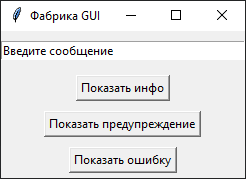
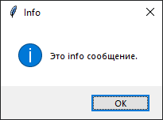
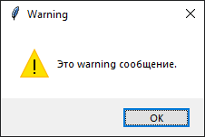
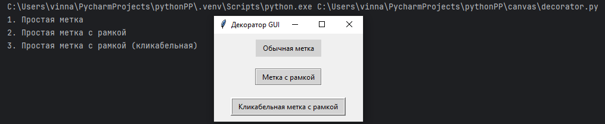
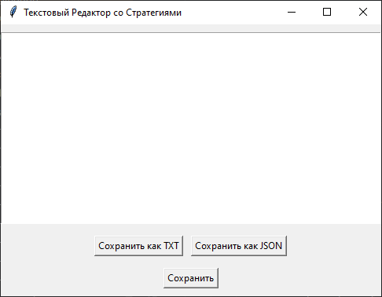
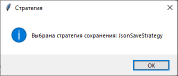
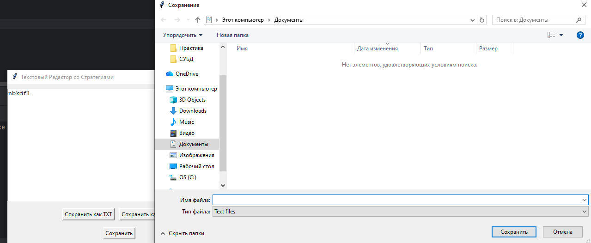

## [Фабрика](#title0)
## [Декоратор](#title1)
## [Стратегия](#title2)

Паттерны проектирования не ограничиваются консольными или серверными приложениями. 

Чрезвычайно полезны при разработке GUI, помогая создавать модульные, гибкие и легко расширяемые пользовательские интерфейсы.

## <a id="title0">Фабрика</a>

* **"Фабрика"** = позволяет делегировать ***создание объектов подклассам***.

    * В GUI это полезно при ***создании различных типов виджетов*** или ***компонентов интерфейса***.

### Пример

Представьте, что у вас есть приложение, которое должно отображать различные типы уведомлений 
(например, информационные, предупреждающие, об ошибках), и каждое уведомление имеет свой уникальный вид (цвет, иконка). 

Вместо того чтобы использовать множество if/else для создания каждого типа уведомления, можно 
использовать фабричный метод.

### Решение

1. **Продукт** = абстрактный класс - уведомления.
```
class Notification(abc.ABC):
    abc.abstractmethod
    def show(self):
        pass
```
2. **Конкретные продукты** = реализация абстрактного класса - типы уведомлений.
```
class InfoNotification(Notification):
    def __init__(self, title, message):
        self.title = title
        self.message=message
    def show(self):
        messagebox.showinfo(self.title, self.message)

class WarningNotification(Notification):
    def __init__(self, title, message):
        self.title = title
        self.message = message
    def show(self):
        messagebox.showwarning(self.title, self.message)

class ErrorNotification(Notification):
    def __init__(self, title, message):
        self.title = title
        self.message = message
    def show(self):
        messagebox.showerror(self.title, self.message)
```
3. **Фабрика** = абстрактный класс с фабричным методом создания классов.
```
class NotificationFactory(abc.ABC):
    @abc.abstractmethod
    def create_notification(self, title, message) -> Notification:
        pass
```
4. **Конкретные фабрики** = реализация абстрактных классов - создание уведомление (в зависимости от выбора пользователя).
```
class InfoNotificationFactory(NotificationFactory):
    def create_notification(self, title, message) -> Notification:
        return InfoNotification(title, message)

class WarningNotificationFactory(NotificationFactory):
    def create_notification(self, title, message) -> Notification:
        return WarningNotification(title, message)

class ErrorNotificationFactory(NotificationFactory):
    def create_notification(self, title, message) -> Notification:
        return ErrorNotification(title, message)
```
5. Создадим класс NotificationApp, который будет хранить в себе ***конкретные фабрики***. Также используем для создания нужного уведомления (зависит от выбранной кнопки).
```
class NotificationApp:
    def __init__(self, master):
        self.master = master
        master.title("Фабрика GUI")

        self.factories = {"info":InfoNotificationFactory(), "warning":WarningNotificationFactory(), "error":ErrorNotificationFactory()}

        self.message_entry = tk.Entry(master, width=40)
        self.message_entry.pack(pady=10)
        self.message_entry.insert(0, "Введите сообщение")

        i_btn = tk.Button(master, text="Показать инфо", command=lambda: self.show_notification("info"))
        i_btn.pack(pady=5)
        w_btn = tk.Button(master, text="Показать предупреждение", command=lambda: self.show_notification("warning"))
        w_btn.pack(pady=5)
        e_btn = tk.Button(master, text="Показать ошибку", command=lambda: self.show_notification("error"))
        e_btn.pack(pady=5)

    def show_notification(self, type):
        message = self.message_entry.get()
        if message == "Введите сообщение" or not message:
            message = f"Это {type} сообщение."
        factory = self.factories.get(type)
        if factory:
            notification = factory.create_notification(type.capitalize(), message)
            notification.show()
```
* Вывод: легко добавлять новые типы уведомлений, не изменяя логику создания в NotificationApp.
Полный код:
```
import tkinter as tk
from tkinter import messagebox
import abc

# Абстрактный класс для уведомлений (Продукт)
class Notification(abc.ABC):
    abc.abstractmethod
    def show(self):
        pass

# Конкретные уведомления (Конкретные продукты)
class InfoNotification(Notification):
    def __init__(self, title, message):
        self.title = title
        self.message=message
    def show(self):
        messagebox.showinfo(self.title, self.message)

class WarningNotification(Notification):
    def __init__(self, title, message):
        self.title = title
        self.message = message
    def show(self):
        messagebox.showwarning(self.title, self.message)

class ErrorNotification(Notification):
    def __init__(self, title, message):
        self.title = title
        self.message = message
    def show(self):
        messagebox.showerror(self.title, self.message)

# Абстрактный класс Фабрики (Фабрика)
class NotificationFactory(abc.ABC):
    @abc.abstractmethod
    def create_notification(self, title, message) -> Notification:
        pass

# Конкретные фабрики
class InfoNotificationFactory(NotificationFactory):
    def create_notification(self, title, message) -> Notification:
        return InfoNotification(title, message)

class WarningNotificationFactory(NotificationFactory):
    def create_notification(self, title, message) -> Notification:
        return WarningNotification(title, message)

class ErrorNotificationFactory(NotificationFactory):
    def create_notification(self, title, message) -> Notification:
        return ErrorNotification(title, message)

class NotificationApp:
    def __init__(self, master):
        self.master = master
        master.title("Фабрика GUI")

        self.factories = {"info":InfoNotificationFactory(), "warning":WarningNotificationFactory(), "error":ErrorNotificationFactory()}

        self.message_entry = tk.Entry(master, width=40)
        self.message_entry.pack(pady=10)
        self.message_entry.insert(0, "Введите сообщение")

        i_btn = tk.Button(master, text="Показать инфо", command=lambda: self.show_notification("info"))
        i_btn.pack(pady=5)
        w_btn = tk.Button(master, text="Показать предупреждение", command=lambda: self.show_notification("warning"))
        w_btn.pack(pady=5)
        e_btn = tk.Button(master, text="Показать ошибку", command=lambda: self.show_notification("error"))
        e_btn.pack(pady=5)

    def show_notification(self, type):
        message = self.message_entry.get()
        if message == "Введите сообщение" or not message:
            message = f"Это {type} сообщение."
        factory = self.factories.get(type)
        if factory:
            notification = factory.create_notification(type.capitalize(), message)
            notification.show()

root = tk.Tk()
app = NotificationApp(root)
root.mainloop()
```
Результат:








<br>
<br>

## <a id="title1">Декоратор</a>

* **"Декоратор"** = позволяет ***динамически добавлять новую функциональность к объекту***. 

* В GUI это может быть использовано:
    * для добавления визуальных эффектов.
    * рамок. 
    * прокрутки.
    * других модификаций к виджетам ***без изменения их базового класса***.

### Пример

Представьте, что у вас есть базовый виджет (например, Label), хотите добавить к нему различные визуальные "украшения" (например, рамку, тень, подсветку) или функциональность (например, возможность перетаскивания). 

Декоратор идеально подходит для этой задачи.

### Решение

1. Компонент - базовый виджет.
```
class WidgetComponent(abc.ABC):
    @abc.abstractmethod
    def get_widget(self) -> tk.Widget:
        pass
    @abc.abstractmethod
    def get_description(self) -> str:
        pass
```
2. Конкретный компонент - простая метка.
```
class SimpleLabel(WidgetComponent):
    def __init__(self, master, text):
        self._label = tk.Label(master, text=text, padx=10, pady=5, bg="lightgray")
    def get_widget(self) -> tk.Widget:
        return self._label
    def get_description(self) -> str:
        return "Простая метка"
```
3. Декоратор.
```
class WidgetDecorator(WidgetComponent, abc.ABC):
    def __init__(self, decorated_widget: WidgetComponent):
        self._decorated_widget = decorated_widget
    def get_widget(self) -> tk.Widget:
        return self._decorated_widget.get_widget()
    @abc.abstractmethod
    def get_description(self) -> str:
        pass
```
4. Конкретные декораторы:
    * BorderDecorator = добавляет рамку к виджету, изменяя его конфигурацию.
    * ClickableDecorator добавляет функциональность обработки кликов, привязывая событие <Button-1> к виджету. 

Вывод:
* Комбинировать эти декораторы, оборачивая один декоратор в другой, чтобы получить виджет с несколькими дополнительными функциями (например, кликабельная метка с рамкой).
```
class BorderDecorator(WidgetDecorator):
    def __init__(self, decorated_widget: WidgetComponent, border_width=2, relief="solid"):
        super().__init__(decorated_widget)
        self._decorated_widget.get_widget().config(bd=border_width, relief=relief)
    def get_description(self) -> str:
        return self._decorated_widget.get_description() + " с рамкой"
class ClickableDecorator(WidgetDecorator):
    def __init__(self, decorated_widget: WidgetComponent, command):
        super().__init__(decorated_widget)
        self._command = command
        self._decorated_widget.get_widget().bind("<Button-1>", self._on_click)
        self._decorated_widget.get_widget().config(cursor="hand2") # Изменяем курсор
    def _on_click(self, event):
        self._command()
    def get_description(self) -> str:
        return self._decorated_widget.get_description() + " (кликабельная)"
```
5. Класс, который использует декоратор.
```
class DecoratedWidgetApp:
    def __init__(self, master):
        self.master = master
        master.title("Декоратор Виджетов")

        # Простая метка
        label1 = SimpleLabel(master, "Обычная метка")
        label1.get_widget().pack(pady=10)
        print(f"1. {label1.get_description()}")

        # Метка с рамкой
        label2 = BorderDecorator(SimpleLabel(master, "Метка с рамкой"), relief="groove")
        label2.get_widget().pack(pady=10)
        print(f"2. {label2.get_description()}")

        # Кликабельная метка с рамкой
        def on_label_click():
            print("Кликабельная метка была нажата!")
            tk.messagebox.showinfo("Клик", "Вы нажали на кликабельную метку!")
        label3 = ClickableDecorator(BorderDecorator(SimpleLabel(master, "Кликабельная метка с рамкой"), border_width=3, relief="ridge"),on_label_click)
        label3.get_widget().pack(pady=10)
        print(f"3. {label3.get_description()}")
```
Полный код:
```
import tkinter as tk
import abc
 # Компонент: Базовый виджет (интерфейс)
class WidgetComponent(abc.ABC):
    @abc.abstractmethod
    def get_widget(self) -> tk.Widget:
        pass
    @abc.abstractmethod
    def get_description(self) -> str:
        pass
 # Конкретный Компонент: Простая метка
class SimpleLabel(WidgetComponent):
    def __init__(self, master, text):
        self._label = tk.Label(master, text=text, padx=10, pady=5, bg="lightgray")
    def get_widget(self) -> tk.Widget:
        return self._label
    def get_description(self) -> str:
        return "Простая метка"
 # Декоратор: Базовый класс для декораторов виджетов
class WidgetDecorator(WidgetComponent, abc.ABC):
    def __init__(self, decorated_widget: WidgetComponent):
        self._decorated_widget = decorated_widget
    def get_widget(self) -> tk.Widget:
        return self._decorated_widget.get_widget()
    @abc.abstractmethod
    def get_description(self) -> str:
        pass
 # Конкретные Декораторы: Добавление функциональности/визуальных эффектов
class BorderDecorator(WidgetDecorator):
    def __init__(self, decorated_widget: WidgetComponent, border_width=2, relief="solid"):
        super().__init__(decorated_widget)
        self._decorated_widget.get_widget().config(bd=border_width, relief=relief)
    def get_description(self) -> str:
        return self._decorated_widget.get_description() + " с рамкой"
class ClickableDecorator(WidgetDecorator):
    def __init__(self, decorated_widget: WidgetComponent, command):
        super().__init__(decorated_widget)
        self._command = command
        self._decorated_widget.get_widget().bind("<Button-1>", self._on_click)
        self._decorated_widget.get_widget().config(cursor="hand2") # Изменяем курсор
    def _on_click(self, event):
        self._command()
    def get_description(self) -> str:
        return self._decorated_widget.get_description() + " (кликабельная)"

# GUI-приложение, использующее декоратор
class DecoratedWidgetApp:
    def __init__(self, master):
        self.master = master
        master.title("Декоратор Виджетов")

        # Простая метка
        label1 = SimpleLabel(master, "Обычная метка")
        label1.get_widget().pack(pady=10)
        print(f"1. {label1.get_description()}")

        # Метка с рамкой
        label2 = BorderDecorator(SimpleLabel(master, "Метка с рамкой"), relief="groove")
        label2.get_widget().pack(pady=10)
        print(f"2. {label2.get_description()}")

        # Кликабельная метка с рамкой
        def on_label_click():
            print("Кликабельная метка была нажата!")
            tk.messagebox.showinfo("Клик", "Вы нажали на кликабельную метку!")
        label3 = ClickableDecorator(BorderDecorator(SimpleLabel(master, "Кликабельная метка с рамкой"), border_width=3, relief="ridge"),on_label_click)
        label3.get_widget().pack(pady=10)
        print(f"3. {label3.get_description()}")

root = tk.Tk()
app = DecoratedWidgetApp(root)
root.mainloop()
```
Результат:



<br>
<br>

## <a id="title2">Стратегия</a>

* **"Стратегия"** = позволяет определять ***семейство алгоритмов и делать их 
взаимозаменяемыми***. 

* В GUI это может быть использовано ***для динамического изменения поведения приложения***, например:
    * различных способов сохранения данных.
    * алгоритмов отображения.
    * методов валидации ввода.

### Пример

Представьте, что у вас есть приложение, которое позволяет сохранять данные в различных форматах (например, TXT, CSV, JSON). 

Вместо того чтобы встраивать всю логику сохранения в один класс, можно использовать паттерн "Стратегия".

### Решение

1. Стратегия - сохранение данных - абсрактный класс.
```
class SaveStrategy(abc.ABC):
    @abc.abstractmethod
    def save(self, data: str, filename: str):
        pass
```
2. Конкретные стратегии - различные способы сохранения: текст, pdf, ...
```
class TextSaveStrategy(SaveStrategy):
    def save(self, data: str, filename: str):
        try:
            with open(filename, "w", encoding="utf-8") as f:
                f.write(data)
            messagebox.showinfo("Сохранение", f"Данные успешно сохранены в {filename} (TXT).")
        except Exception as e:
            messagebox.showerror("Ошибка сохранения", f"Не удалось сохранить файл: {e}")
class JsonSaveStrategy(SaveStrategy):
    def save(self, data: str, filename: str):
        try:
            # Попытка распарсить данные как JSON, если не удается, сохраняем как строку
            try:
                json_data = json.loads(data)
            except json.JSONDecodeError:
                json_data = {"content": data}
            with open(filename, "w", encoding="utf-8") as f:
                json.dump(json_data, f, indent=4, ensure_ascii=False)
            messagebox.showinfo("Сохранение", f"Данные успешно сохранены в {filename} (JSON).")
        except Exception as e:
            messagebox.showerror("Ошибка сохранения", f"Не удалось сохранить файл: {e}")
```
3. Контекст - приложение/класс, который использует стратегию.
```
class TextEditorApp:
    def __init__(self, master):
        self.master = master
        master.title("Текстовый Редактор со Стратегиями")
        self.text_area = tk.Text(master, height=15, width=60, wrap="word")
        self.text_area.pack(pady=10)
        self.save_strategy = TextSaveStrategy() # Стратегия по умолчанию

        # Кнопки для выбора стратегии сохранения
        strategy_frame = tk.Frame(master)
        strategy_frame.pack(pady=5)
        text_btn = tk.Button(strategy_frame, text="Сохранить как TXT", command=lambda: self.set_save_strategy(TextSaveStrategy()))
        text_btn.pack(side=tk.LEFT, padx=5)
        json_btn = tk.Button(strategy_frame, text="Сохранить как JSON", command=lambda: self.set_save_strategy(JsonSaveStrategy()))
        json_btn.pack(side=tk.LEFT, padx=5)

        # Кнопка сохранения
        save_btn = tk.Button(master, text="Сохранить", command=self.save_content)
        save_btn.pack(pady=10)
    def set_save_strategy(self, strategy: SaveStrategy):
        self.save_strategy = strategy
        messagebox.showinfo("Стратегия", f"Выбрана стратегия сохранения: {strategy.__class__.__name__}")
    def save_content(self):
        content = self.text_area.get("1.0", tk.END).strip()
        if not content:
            messagebox.showwarning("Внимание", "Текстовое поле пусто.")
            return

        # Запрашиваем имя файла у пользователя
        file_path = filedialog.asksaveasfilename(defaultextension=".txt" if isinstance(self.save_strategy, TextSaveStrategy) else ".json", filetypes=[("Text files", "*.txt"), ("JSON files", "*.json"), ("All files", "*.*")])
        if file_path:
            self.save_strategy.save(content, file_path)
```
Полный код:
```
import tkinter as tk
from tkinter import filedialog, messagebox
import abc
import json

# Интерфейс Стратегии: Сохранение данных
class SaveStrategy(abc.ABC):
    @abc.abstractmethod
    def save(self, data: str, filename: str):
        pass
# Конкретные Стратегии: Различные способы сохранения
class TextSaveStrategy(SaveStrategy):
    def save(self, data: str, filename: str):
        try:
            with open(filename, "w", encoding="utf-8") as f:
                f.write(data)
            messagebox.showinfo("Сохранение", f"Данные успешно сохранены в {filename} (TXT).")
        except Exception as e:
            messagebox.showerror("Ошибка сохранения", f"Не удалось сохранить файл: {e}")
class JsonSaveStrategy(SaveStrategy):
    def save(self, data: str, filename: str):
        try:
            # Попытка распарсить данные как JSON, если не удается, сохраняем как строку
            try:
                json_data = json.loads(data)
            except json.JSONDecodeError:
                json_data = {"content": data}
            with open(filename, "w", encoding="utf-8") as f:
                json.dump(json_data, f, indent=4, ensure_ascii=False)
            messagebox.showinfo("Сохранение", f"Данные успешно сохранены в {filename} (JSON).")
        except Exception as e:
            messagebox.showerror("Ошибка сохранения", f"Не удалось сохранить файл: {e}")

# Контекст: Приложение для сохранения текста
class TextEditorApp:
    def __init__(self, master):
        self.master = master
        master.title("Текстовый Редактор со Стратегиями")
        self.text_area = tk.Text(master, height=15, width=60, wrap="word")
        self.text_area.pack(pady=10)
        self.save_strategy = TextSaveStrategy() # Стратегия по умолчанию

        # Кнопки для выбора стратегии сохранения
        strategy_frame = tk.Frame(master)
        strategy_frame.pack(pady=5)
        text_btn = tk.Button(strategy_frame, text="Сохранить как TXT", command=lambda: self.set_save_strategy(TextSaveStrategy()))
        text_btn.pack(side=tk.LEFT, padx=5)
        json_btn = tk.Button(strategy_frame, text="Сохранить как JSON", command=lambda: self.set_save_strategy(JsonSaveStrategy()))
        json_btn.pack(side=tk.LEFT, padx=5)

        # Кнопка сохранения
        save_btn = tk.Button(master, text="Сохранить", command=self.save_content)
        save_btn.pack(pady=10)
    def set_save_strategy(self, strategy: SaveStrategy):
        self.save_strategy = strategy
        messagebox.showinfo("Стратегия", f"Выбрана стратегия сохранения: {strategy.__class__.__name__}")
    def save_content(self):
        content = self.text_area.get("1.0", tk.END).strip()
        if not content:
            messagebox.showwarning("Внимание", "Текстовое поле пусто.")
            return

        # Запрашиваем имя файла у пользователя
        file_path = filedialog.asksaveasfilename(defaultextension=".txt" if isinstance(self.save_strategy, TextSaveStrategy) else ".json", filetypes=[("Text files", "*.txt"), ("JSON files", "*.json"), ("All files", "*.*")])
        if file_path:
            self.save_strategy.save(content, file_path)

root = tk.Tk()
app = TextEditorApp(root)
root.mainloop()
```
Результат:






