# Содержание

### [CSV](#title0)
### [JSON](#title1)
### [Преобразование данных между форматами](#title2)

Для работы обмена и хранения структурированной информации.


Понимание форматов позволит взаимодействовать с различными источниками данных:
* веб-сервисы
* базы данных
* аналитические системы

## <a id="title0">CSV</a>

* **СSV** = текстовый формат для представления табличных данных.

Значения разделены:
* запятой
* точкой с запятой
* или другими разделителями

У Python свой встроенный модуль.

### Чтение CSV-файлов. reader

* **csv.reader** = ***для итерации по строкам***.

+ **newline=""** = параметр при открытии csv файлов. ***Предотвращает автоматическое преобразование символов новой строки***, что может привести к пустым строкам между записями.

* **csv.reader(csvfile)** = ***создаёт объект reader***, который ***итерирует по строкам в csv-файле***.

+ next(reader) = ***читает первую строку*** из считанного файла и ***перемещает указатель на следующую строку***.

### Пример


```
import csv

with open("data.csv", "r", newline="") as f:
    reader = csv.reader(f)
    header = next(reader) # Читаем заголовок
    print(f"Заголовок {header}")
    for row in reader:
        print(row)
```
Результат:

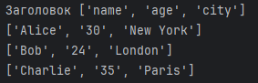

### Чтение CSV-файлов. DictReader

+ **csv.DictReader** = ***для чтения данных, как словарей, где ключами являются заголовки***.
            
    * ***Создает объект reader***, который ***отображает каждую строку в словарь***, используя ***значения из первой строки CSV-файла в качестве ключей***.

* **reader.fieldnames** = ***список имен полей (заголовков столбцов)***.
### Пример
```
with open("data.csv", "r", newline="") as f:
    reader = csv.DictReader(f)
    print(f"Заголовки  столбцов: {reader.fieldnames}")
    for row in reader:
        print(row)
        print(f"Имя: {row["name"]}, Возраст: {row["age"]}")
```
Результат:


### Запись в CSV-файл. writer

* **csv.writer(csvfile)** = ***создаёт объект writer***.

+ **writer.writerow(row)** = ***записывает 1 строку***. row = список строк.

* **writer.writerows(rows)** = ***записывает несколько строк***. rows = список списка строк.

### Пример
```
data_to_write = [["product", "price", "quantity"], ["Laptop", 80000, 10], ["Mouse", 750, 15], ["Keyboard", 900, 23]]
with open("products.csv", "w", newline="") as f:
    writer = csv.writer(f) # Появляется пустой файл
    writer.writerows(data_to_write) # Записываем в файл все строки сразу
with open("products.csv", "r") as f:
    print(f.read())
```
Результат:

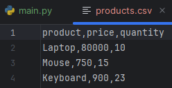

### Запись в CSV-файл. DictWriter

* **csv.DictWriter(csvfile, fieldnames=fieldnames)** = ***создаёт объект writer, записывает словари***. 

    * **fieldnames** = ***обязателен*** и ***определяет порядок столбцов***.

+ **writer.writeheader()** = ***записывает заголовочную строку***, используя ***fieldnames***.

### Пример
```
data_to_write_dict = [{"name": "Tablet", "price": 300, "quantity" : 15}, {"name": "Monitor", "price": 200, "quantity": 16}]
with open("new_products.csv", "w", newline="") as f:
    fieldnames = ["name", "price", "quantity"]
    writer = csv.DictWriter(f, fieldnames=fieldnames)
    writer.writeheader() # Записываем заголовок
    writer.writerows(data_to_write_dict) # Записываем данные
```
Результат:

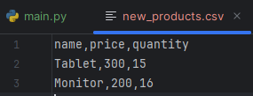

<br>

## <a id="title1">JSON</a>

* **JSON** - JavaScript Object Notation - ***формат обмена данными***, который легко читается человеком и парсится машинами.

Структура:

1. **Объект** = ***набор пар ключ/значение***.
2. **Массив** = ***упорядоченный набор значений***.

### Сериализация JSON = запись

**Сериализация** = ***процесс преобразования Python (словари, списки, строки, числа, булевы значения, None) в JSON-строку*** или ***запись их в файл***.

+ **json.dumps(data, indent=4)** = ***преобразуют Python-объект data в JSON-строку***. Параметр **indent** = делает вывод более читаемым, ***добавляя отступы***.

* **json.dump(data, json_file, indent=4)** = ***записывает Python-объект data непосредственно в файл json_file***.

+ **encoding="utf-8"** = ***для корректной работы с не ASCII символами***.

### Пример
```
import json

data = {"name": "John Doe", "age": 20, "courses": ["History", "Math", "Art"], "address": {"street": "123 Main St", "city": "Washington", "zip": "12345678"}}

# Сериализация в строку JSON
json_string = json.dumps(data, indent=4)
print("Сериализация в строку JSON:")
print(json_string)

# Сериализация в файл JSON
with open("output.json", "w", encoding="utf-8") as json_file:
    json.dump(data, json_file, indent=4)
print(f"\n Файл output.json создан")

# Вывод содержимого
with open("output.json", "r") as f:
    print(f.read())
```
Результат:

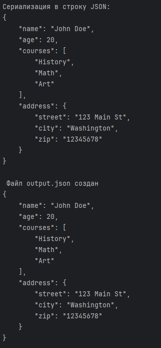

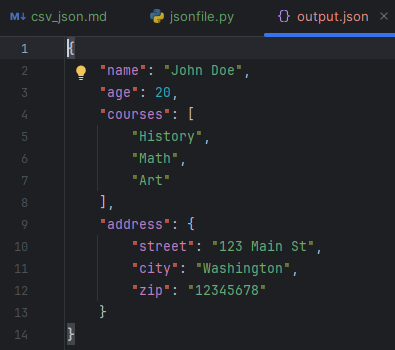

### Десериализация JSON = чтение

**Десериализация** = ***процесс преобразования строки JSON*** или ***содержимого JSON-файла обратно в Python-объект***.

* **json.loads(json_string_to_load)** = ***преобразует JSON-строку в Python-объект (словарь или список)***.

+ **json.load(json_file)** = ***читает JSON из файла*** и ***преобразует в Python-объект***.

### Пример
```
# JSON-строка для десериализации
json_string_to_load = """
{
    "name": "Kathryn Janeway",
    "age": 40,
    "occupation": "Capitan"
}
"""

# Десериализация из строки
load_data_from_string = json.loads(json_string_to_load)
print(f"\nДесериализация из строки: ")
print(load_data_from_string)
print(f"Имя: {load_data_from_string["name"]}")

# Десериализация из файла
with open("output.json", "r", encoding="utf-8") as json_file:
    load_data_from_file = json.load(json_file)
print(f"\nДесериализация из файла: ")
print(load_data_from_file)
print(f"Курсы: {load_data_from_file["courses"]}")
```
Результат:


### Обработка ошибок при работе с JSON

* **Если файл не является корректным JSON-документом*** = **JSONDecodeError**.

### Пример
```
import json

# Некорректная JSON-строка
json_string = "{\"name\": \"Test\", \"age\": 23,"

try:
    data = json.loads(json_string)
    print(data)
except json.JSONDecodeError as e:
    print(f"Ошибка декодирования JSON: {e}")

# Попытка прочитать несуществующий файл
try:
    with open("jknfivnfdn.json", "r") as f:
        data = json.load(f)
except FileNotFoundError:
    print("Файл не найден.")
except json.JSONDecodeError as e:
    print(f"Ошибка декодирования JSON из файла: {e}")
```
Результат:

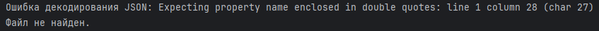

<br>

## <a id="title2">Преобразование данных между форматами</a>

Иногда возникает необходимость преобразовать данные из 1 формата в другой.

### Пример = CSV в JSON
```
import csv
import json

# Создаём контент для CSV
csv_content = """id,item,price
1,Apple,100
2,Banana,120
3,Orange,130
"""
with open("items.csv", "w", newline="") as f:
    f.write(csv_content)
data=[]
with open("items.csv", "r", newline="") as csv_file:
    reader = csv.DictReader(csv_file)
    for row in reader:
        # Преобразуем числовые значения, если необходимо
        row['id'] = int(row['id'])
        row['price'] = int(row['price'])
        data.append(row)
with open("items.json", "w", encoding="utf-8") as json_file:
    json.dump(data, json_file, indent=4)
print(f"Данные из items.csv успешно конвертированы в json.csv.")
with open("items.json", "r") as f:
    print(f.read())
```
Результат:

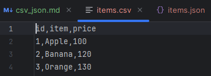

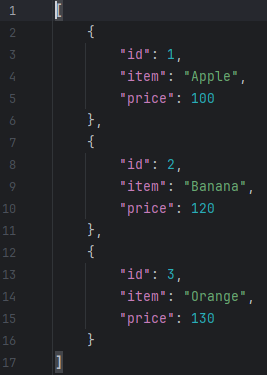

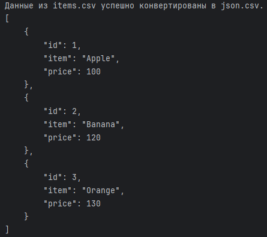

### Пример = JSON в CSV
```
import json
import csv

# Создаём контент JSON
json_content = """
[
    {
        "name": "Laptop,
        "category": "Electronic",
        "stock": 10
    },
    {
        "name": "Desk",
        "category": "Furniture",
        "stock": 5
    }
]
"""
with open("products.json", "w", encoding="utf-8") as f:
    f.write(json_content)
with open("products.json", "r", encoding="utf-8") as json_file:
    data = json.load(json_file)
if data:
    # Получаем заголовки из ключей первого словаря
    fieldnames = list(data[0].keys())
    with open("products.csv", "w", newline="") as csv_file:
        writer = csv.DictWriter(csv_file, fieldnames=fieldnames)
        writer.writeheader()
        writer.writerows(data)
    print(f"Данные из products.json успешно конвертированы в products.csv.\n")
    with open("products.csv", "r") as f:
        print(f.read())
else:
    print("JSON-файл пуст или содержит некорректные данные.")
```
Результат:

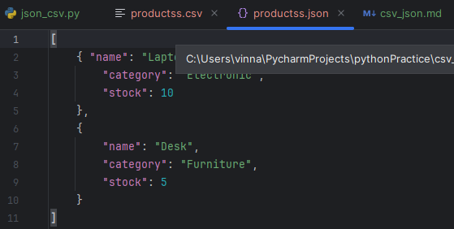

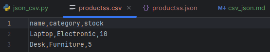

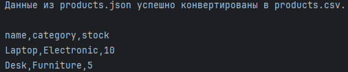