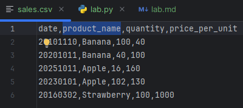
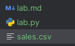
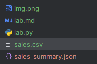
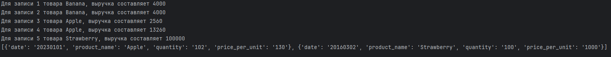
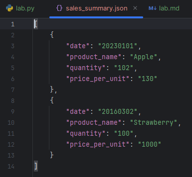

# Содержание
### [Задание](#title0)
### [Реализация](#title1)

## <a id="title0">Задание = Анализатор данных о продажах</a>

У вас есть CSV-файл sales.csv со следующими столбцами: 
* date 
* product_name
* quantity 
* price_per_unit 

Создайте программу, которая:
1. Читает данные из sales.csv. 
2. Рассчитывает общую выручку (quantity * price_per_unit) для каждой записи.
3. Находит самый продаваемый товар (по количеству) и самый прибыльный товар 
(по общей выручке).
4. Сохраняет результаты анализа (например, общая выручка, топ-товары) в новый JSON-файл sales_summary.json.

## <a id="title0">Реализация</a>

1. Импорт json, csv.

2. Используем try-except, чтобы обработать случай, когда файл нет в директории.

3. Зададим список data_top_sum. В нём разместим 2 вида товара с максимальным количеством и, с которого получили максимальную прибыль.

4. Откроем, созданный файл вручную, с помощью функции open() и "r" для чтения.

5. Создадим объект reader с помощью класса DictReader, который return список словарей data. Присвоим его переменной data.

6. Пройдемся по нашему списку словарей и выведем полученную информацию: рассчитанную общую прибыль для товара.

7. Подсчитаем самый продаваемый товар (по количеству) и самый прибыльный товар (по общей выручке).

8. Пройдёмся ещё раз по нашему списку словарей data, чтобы извлечь нужные строки с максимальными значениями и добавить их в список data_top_sum.

9. Открываем файл на запись JSON = сериализация. Используем dump() и указываем:

    * имя переменной, у которой объект файла.
    * список
    * indent, чтобы визуально отображение было эстетичное.

### Пример

Файл с записями и расположение:





Полный код:
```
import json
import csv

try:
    data_top_sum = []
    result_quantity, result_sum = 0, 0
    with open("sales.csv", "r") as csv_file:
        data = csv.DictReader(csv_file)
        for i, row in enumerate(data):
            print(f"Для записи {i+1} товара {row["product_name"]}, выручка составляет {int(row["quantity"]) * int(row["price_per_unit"])}")
            result_quantity = int(row["quantity"]) if i == 0 else max(int(row["quantity"]), result_quantity)
            result_sum = int(row["quantity"]) * int(row["price_per_unit"]) if i == 0 else max(int(row["quantity"]) * int(row["price_per_unit"]), result_sum)
    with open("sales.csv", "r") as csv_file:
        data_n = csv.DictReader(csv_file)
        for i, row in enumerate(data_n):
            if result_sum == int(row["quantity"]) * int(row["price_per_unit"]) or result_quantity == int(row["quantity"]):
                data_top_sum.append(row)
    with open("sales_summary.json", "w", encoding="utf-8") as jsonfile:
        json.dump(data_top_sum, jsonfile, indent=4)
    print(data_top_sum)
except FileNotFoundError:
    print("Добавьте файл для считывания\n")
```
Реализация:





