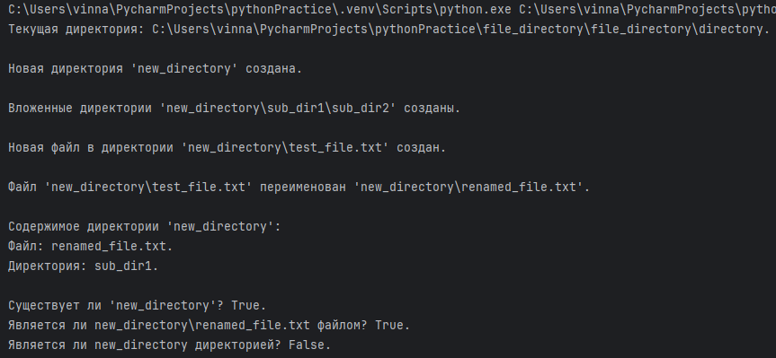
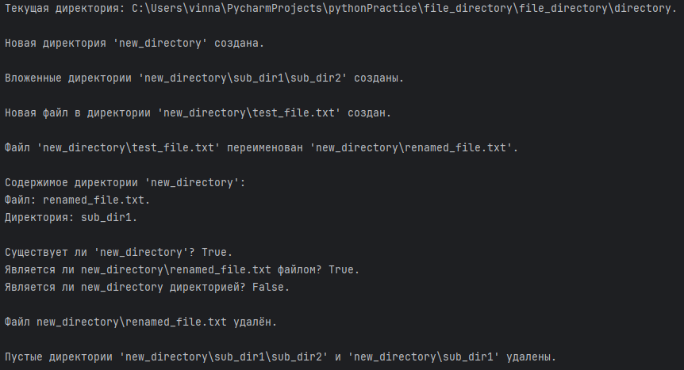
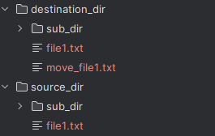
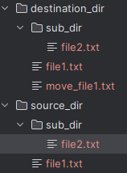
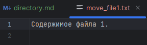
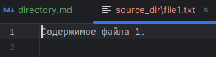
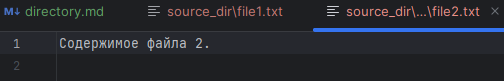
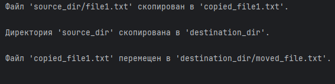
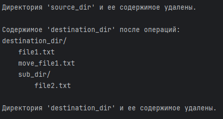

# Работа с директориями

### [2.1 Модуль os и os.path](#title0)
### [2.2 Модуль shutil](#title1)

* Модуль **os** в Python предоставляет функции ***для взаимодействия с ОС***, включая работу с файловой системой.


* **os.path** содержит ***утилиты для работы с путями***.


* **shutil** = ***высокоуровневых операций с файлами и директориями***.

## <a id="title0">2.1 Модуль os и os.path</a>

* **os.getcwd()** = return ***текущую рабочую директорию***.


+ **os.chdir(path)** = ***изменяет текущую рабочую директорию***.

* **os.listdir(path='.')** = return ***список имён файлов и поддиректорий в указанной директории*** (по умолчанию - текущая).

    * ***Только имена файлов и папок, а не полные пути***.

    * Для полных используйте os.path.join().

+ **os.mkdir(path)** = ***создаёт новую директорию***. Вызывает FileExistError, если файл уже существует.

* **os.makedirs(path, exist_ok=False)** = ***создаёт все промежуточные директории в пути, если они не существуют***.
    * **exist_ok=True** = если конечная директория существует, то предотвращает ошибку.
    * ***Удобен, когда хз, существуют ли уже все части пути***.

+ **os.rmdir(path)** = ***удаляет пустую директорию***. Вызывает **OSError** = ***дирекория не пуста***.

* **os.remove(path)** = ***удаляет файл***.

+ **os.rename(src, dst)** = ***переименовывает файл*** или ***директорию src -> dst***.

* os.path.join(path, *paths) = ***объединяет 1 или несколько компонентов пути***.
    + Кроссплатформенный (Linux, macOs /; Windows \)

+ **os.path.exists(path)** = ***проверяет есть ли путь***.

* **os.path.isfile(path)** = ***проверяет есть ли путь***.

+ **os.path.isdir(path)** = ***проверяет есть ли файл***.

* **os.path.abspath(path)** = return ***абсолютный путь***.

+ **os.path.basename(path)** = return ***базовое имя директории/файла/последней директории***.

* **os.path.dirname(path)** = return ***имя директории пути***.

### Пример = работа с путями и директориями
```
import os

# Получение текущей директории

current_dir = os.getcwd()
print(f"Текущая директория: {current_dir}.\n")


# Создание новой директории

new_dir = "new_directory"
if not os.path.exists(new_dir):
    os.mkdir(new_dir)
    print(f"Новая директория '{new_dir}' создана.\n")
else:
    print(f"Директория '{new_dir}' уже существует.\n")


# Создание вложенных директорий

nested_dir = os.path.join(new_dir, "sub_dir1", "sub_dir2")
if not os.apth.exists(nested_dir):
    os.makedirs(nested_dir, exist_ok=True)
    print(f"Вложенные директории '{nested_dir}' созданы.\n")
else:
    print(f"Вложенные директории '{nested_dir}' уже существуют.\n")


# Создание файла внутри директории

file_in_new_dir = os.path.join(new_dir, "test_file.txt")
with open(file_in_new_dir, "w") as f:
    f.write("Это тестовый файл.")
print(f"Новая файл в директории '{file_in_new_dir}' создан.\n")


# Переименуем файл

old_file_name = file_in_new_dir
new_file_name = os.path.join(new_dir, "renamed_file.txt")
os.rename(old_file_name, new_file_name)
print(f"Файл '{old_file_name}' переименован '{new_file_name}'.\n")


# Получение списка содержимого директории

print(f"Содержимое директории '{new_dir}':")
for i in os.listdir(new_dir):
    full_path = os.path.join(new_dir, i)
    if os.path.isfile(full_path):
        print(f"Файл: {i}.")
    elif os.path.isdir(full_path):
        print(f"Директория: {i}.")


# Проверка существование пути

print(f"\nСуществует ли '{new_dir}'? {os.path.exists(new_dir)}.")
print(f"Является ли {new_file_name} файлом? {os.path.isfile(new_file_name)}.")
print(f"Является ли {new_dir} директорией? {os.path.isfile(new_dir)}.\n")
```
Результат:




### Продолжение примера
```
# Удаление файла

os.remove(new_file_name)
print(f"Файл {new_file_name} удалён.\n")


# Удаление пустой директории

os.rmdir(nested_dir)
os.rmdir(os.path.join(new_dir, "sub_dir1"))
print(f"Пустые директории '{nested_dir}' и '{os.path.join(new_dir, "sub_dir1")}' удалены.\n")


# Попытка удалить непустую дирекорию вызовет => вызовет ошибку shutil.rmtree.
# os.rmdir(new_dir) вызовет OSError, так как папка не пуста.

if not os.path.exists(new_dir):
    shutil.rmtree(new_dir)
    print(f"Удалена {new_dir} и всё её содержимое.")
```




<br>

## <a id="title0">2.2 Модуль shutil</a>

Модуль shutil = предоставляет ***высокоуровневые операции с файлами или коллекциями с файлами***.
* ***Дополняет os***.


***Удобен для копирования, перемещения и удаления целых деревьев директорий***.

+ **shutil.copy(src, dst)** = ***копирует src в dst***. 
    + dst = директория или имя файла.

* **shutil.copytree(src, dst)** = ***рекурсивно копирует всю директорию src в dst***.

+ **shutil.move(src, dst)** = ***перемещает/переименовывает файл/директорию src в dst***.

* **shutil.rmtree(path)** = ***рекурсивно удаляет директорию вместе с содержимым***.

### Пример использования
```
import os
import shutil

# Создаём директории и файлы

if not os.path.exists("source_dir"):
    os.makedirs("source_dir/sub_dir")
    with open("source_dir/file1.txt", "w") as f:
        f.write("Содержимое файла 1.\n")
    with open("source_dir/sub_dir/file2.txt", "w") as f:
        f.write("Содержимое файла 2.\n")


# Копирование файлов

shutil.copy("source_dir/file1.txt", "copied_file1.txt")
print("Файл 'source_dir/file1.txt' скопирован в 'copied_file1.txt'.\n")


# Копирование директории

if not os.path.exists("destination_dir"):
    shutil.rmtree("destination_dir") # Удаляем, если уже существует
shutil.copytree("source_dir", "destination_dir")
print("Директория 'source_dir' скопирована в 'destination_dir'.\n")


# Перемещение файла

shutil.move("copied_file1.txt", "destination_dir/move_file1.txt")
print("Файл 'copied_file1.txt' перемещен в 'destination_dir/moved_file.txt'.\n")
```
Результат:















### Продолжение примера
```
# Удаляем директорию

if os.path.exists("source_dir"):
    shutil.rmtree("source_dir")
    print("Директория 'source_dir' и ее содержимое удалены.\n")


# Проверка содержимого destination_dir

print("Содержимое 'destination_dir' после операций: ")
for root, dirs, files in os.walk("destination_dir"):
    level = root.replace("destination_dir", '').count(os.sep) # Заменяет в пути "destination_dir" на '' и подсчитывает разделители / или \
    indent = '' * 4 * (level)
    print(f'{indent}{os.path.basename(root)}/')
    subindent = '' * 4 * (level+1)
    for f in files:
        print(f'{subindent}{f}')


# Удаляем

if os.path.exists("destination_dir"):
    shutil.rmtree("destination_dir")
    print("\nДиректория 'destination_dir' и ее содержимое удалены.")
```
Результат:



* **shutil.copytree()** = создаёт новую директорию destination_dir и копирует туда всё содержимое source_dir.

+ **shutil.move()** = выполняет как переименование, так и перемещение файлов/директорий. 
    * Если dst находится на том же файловой системе, что и src = просто переименование; 
    * в противном случае = копирование, а затем удаление src.

* **os.walk()** = ***для обхода дерева директорий***. 

    * ***Return кортежи (root, dirs, files) для каждой директории в дереве, начиная с root***.