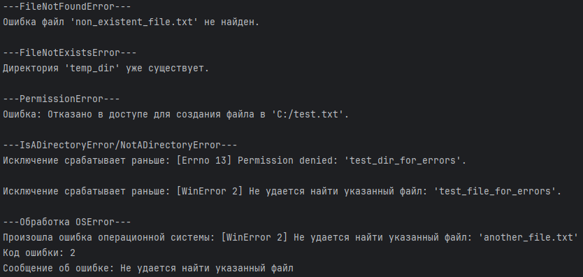

# Обработка исключений при работе с файловой системой

При работе с файлами/директориями могут возникать исключения:
+ файл не найден
+ права доступа
+ файл уже существует
+ ...

Важно корректно обрабатывать исключения, чтобы приложение не сломалось и пользователю предоставили информацию о том, что случилось.

**Исключения**:

* **FileNotFoundError** = ***файл/директория уже существуют***. 


* **FileExistsError** = ***файл/директория, которую пытаетесь создать, уже существует***.


* **PermissionError** = ***от. в доступе***. (чтение/запись/создание)


* **IsADirectoryError** = ***попытка выполнить файловую операцию над директорией***. (открыть директорию как файл)


* **OSError** = ***общее исключение для оши... ОС***. Базовым классом для многих ошибок, связанных с ОС, включая ошибки файловой системы. 
Содержит атрибуты:
    * **errno** = ***номер ошибки***. 
    * **strerror** = ***сообщение об ошибке***, которые могут быть полезны для отладки.

<br>

+ **try** = ***выполняет основной код***.


+ **except** = ***обрабатывает исключения, если возникают в блоке try***.


+ **finally** = используется для кода, который должен быть **выполнен в любом случае**:
    + для ***закрытия файлов***.
    + для ***освобождения ресурсов***.
    * ***выполняется после try и except (если except был выполнен)***.
    * или ***после try, если исключения не было***. 
    * или ***даже если оно было, но не было перехвачено***.


Это позволяет программе продолжать работу, даже если произошла ошибка файловой системы.

### Пример = обработка исключений
```
import os

# 1. FileNotFoundError

print("---FileNotFoundError---")
try:
    with open("non_existent_file.txt", "r") as f:
        content = f.read()
        print(content)
except FileNotFoundError:
    print("Ошибка файл 'non_existent_file.txt' не найден.\n")


# 2. FileNotExistsError

print("---FileNotExistsError---")
try:
    os.mkdir("temp_dir")
    os.mkdir("temp_dir") # Попытка создать существующую директорию
except FileExistsError:
    print("Директория 'temp_dir' уже существует.\n")
finally:
    if os.path.exists("temp_dir"):
        os.rmdir("temp_dir") # Удаляем


# 3. PermissionError

print("---PermissionError---")
protected_path = "C:/test.txt"
try:
    with open(protected_path, "w") as f:
        f.write("Тест")
    print(f"Файл создан в защищённой директории: {protected_path}.\n")
except PermissionError:
    print(f"Ошибка: Отказано в доступе для создания файла в '{protected_path}'.\n")
except Exception as e:
    print(f"Произошла другая ошибка: {e}")


# 4. IsADirectoryError/NotADirectoryError

print("---IsADirectoryError/NotADirectoryError---") 
if not os.path.exists("test_dir_for_errors"):         # Создаём тестовую директорию и файл
    os.mkdir("test_dir_for_errors")
with open("test_file_for_errors.txt", "w") as f:
    f.write("test")
    
try:
    with open("test_dir_for_errors", "r") as f: # Попытка открыть директорию как файл
        pass
except IsADirectoryError:
    print("Ошибка: Попытка открыть директорию как файл.")
except PermissionError as e:
    print(f"Исключение срабатывает раньше: {e}.\n")
    
try:
    os.rmdir("test_file_for_errors") # Попытка удалить файл как директорию
except NotADirectoryError:
    print("Ошибка: Попытка удалить файл как директорию.")
except FileNotFoundError as e:
    print(f"Исключение срабатывает раньше: {e}.\n")
finally:
    if os.path.exists("test_dir_for_errors"):
        os.rmdir("test_dir_for_errors")
    if os.path.exists("test_file_for_errors"):
        os.remove("test_file_for_errors")


# 5. OSError

print("---Обработка OSError---")
try:
    # Попытка удалить несуществующий файл
    os.remove("another_file.txt")
except OSError as e:
    print(f"Произошла ошибка операционной системы: {e}")
    print(f"Код ошибки: {e.errno}")
    print(f"Сообщение об ошибке: {e.strerror}")
```
Результат:

