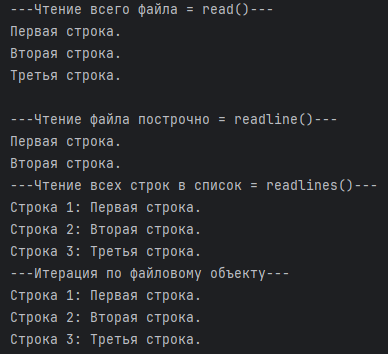
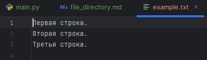
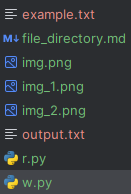
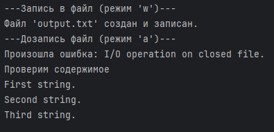
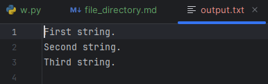

# Работа с файлами

### [1.1 Режим открытия файлов](#title0)
### [1.2 Чтение файлов](#title1)
### [1.3 Запись файлов](#title2)

* ***Работа с файлами*** осуществляется с помощью встроенной функции open() = **return file's object**.

* Этот объект используется:
  + чтения
  + записи
  + изменения файла

* После завершения работы с файлом, его нужно закрыть, чтобы освободить системные ресурсы и гарантировать сохранения данных = **close()**.

<br>

## <a id="title0">1.1 Режим открытия файлов</a>

Функция open() = от 2 и более аргументов:

* **'r'** = ***read*** = **открытие файла для чтения**. Есл файла нет, то возникает ошибка ***FileNotFoundError***.


* **'w'** = ***write*** = **для записи**. Если файл существует, его ***содержимое будет перезаписано***. ***Если его нет, то он будет создан***.


* **'a'** = ***append*** = **для обновления (до записи)**. Если файл существует, данные будут ***добавлены в конец файла***. ***Если его нет, то он будет создан***.


* **'x'** = ***exclusive creation*** = **для эксклюзивного создания**. Если файл существует, то возникает ошибка ***FileExistError***. Полезно для предотвращения перезаписи существующих файлов.


* **'b'** = ***binary*** = **бинарный режим**. Используется для сочетания с другими режимами (**'rb'**, **'wb'**) для работы с нетекстовыми файлами:
  * изображения
  * аудио
  * исполняемые файлы


* **'t'** = text = **текстовый режим**. Используется для сочетания с другими режимами (**'rt'**, **'wt'**) для работы с текстовыми файлами. В этом режиме Python автоматически обрабатывает кодировку символов.

### Пример
```
open('file.txt', 'w') 
```
* откроет файл на запись в текстовом режиме (по умолчанию).

## <a id="title1">1.2 Чтение файлов</a>

После открытия файла для чтения можно использовать следующие методы:

* **read(size=1)** = читает size байт из файла (или символов в текстовом режиме). Если size не указан ил == -1 = ***читает весь файл***.


* **readline()** = читает 1 строку из файла, включая \n.


* **readlines()** = читает все строки из файла и return список строк.

### Пример = чтение файла
```
# Создадим текстовый файл

with open("example.txt", "w", encoding="utf-8") as f: # Создадим текстовый файл
    f.write("Первая строка.\n")
    f.write("Вторая строка.\n")
    f.write("Третья строка.\n")
    
    
print("---Чтение всего файла = read()---")
try:
    with open("example.txt", "r", encoding="utf-8") as f:
        content = f.read()
        print(content)
except FileNotFoundError:
    print("Файл не найден.")
except Exception as e:
    print(f"Произошла ошибка: {e}")
    
    
print("---Чтение файла построчно = readline()---")
try:
    with open("example.txt", "r", encoding="utf-8") as f:
        line1 = f.readline()
        line2 = f.readline()
        print(line1.strip())
        print(line2.strip())
except FileNotFoundError:
    print("Файл не найден.")
except Exception as e:
    print(f"Произошла ошибка: {e}")
    
    
print("---Чтение всех строк в список = readlines()---")
try:
    with open("example.txt", "r", encoding="utf-8") as f:
        lines = f.readlines()
        for i, line in enumerate(lines):
            print(f"Строка {i+1}: {line.strip()}") # удаляет начальные и конечные символы.
except FileNotFoundError:
    print("Файл не найден.")
except Exception as e:
    print(f"Произошла ошибка: {e}")
    
    
print("---Итерация по файловому объекту---")
try:
    with open("example.txt", "r", encoding="utf-8") as f:
        for i, line in enumerate(f):
            print(f"Строка {i+1}: {line.strip()}")
except FileNotFoundError:
    print("Файл не найден.")
except Exception as e:
    print(f"Произошла ошибка: {e}")
```
* **encoding** = имя кодировки, используемой для декодирования или кодирования файла. Важно для корректной работы с текстом, особенно содержащим нелатинские символы.


- **enumerate()**:

    * **Когда нужны индекс и значение элемента**: в циклах for, где нужно ***значение индекса***, ***элемент коллекции***.

    * **Для повышения читаемости кода**: enumerate() делает код более явным и понятным, так как избавляет от необходимости использовать range(len(my_list)) и my_list[i] в теле цикла.

    * **Для работы с итерируемыми объектами, не имеющими len()**: когда работаете ***с генераторами, файлами*** или другими "ленивыми" структурами данных, где метод len() может быть ***неприменим или неэффективен***.


+ **with open(...) as file** = **контекстный менеджер** = ***файл будет авто закрыт, даже если произойдёт ошибка***.


* **read** = return контент 1 строкой.


* **readline** = return по 1 строке за раз.


* **readlines** = return список строк.

Результат:






Наиболее эффективный способ ***чтения файлов построчно*** = ***итерировать по файловому объекту*** = **for line in file**. Python читает файл построчно, что правильно для памяти при работе с большими файлами.

<br>

## <a id="title2">1.3 Запись файлов</a>

Для записи данных в файл используется: **write()** и **writelines()**.

**write(string)**:

+ ***Записывает указанную строку в файл***.


+ ***Return количество записанных символов***.


+ Если хотите добавить \n, то вручную.


**writelines(list_of_string)**:

+ ***Записывает список строк в файл***.


+ ***Лучше для каждой строки добавить \n***.

### Пример = запись и дозапись в файл.
```
print("---Запись в файл (режим 'w')---")
try:
    with open("output.txt", "w", encoding="utf-8") as f:
        f.write("First string.\n")
        f.write("Second string.\n")
        f.write("Third string.\n")
    print("Файл 'output.txt' создан и записан.")
except Exception as e:
    print(f"Произошла ошибка: {e}")
    
    
print("---Дозапись файл (режим 'a')---")
try:
    with open("output.txt", "a", encoding="utf-8"):
        f.write("New string append to the end at the line.")
        f.writelines(["Ещё 1 строка.\n", "И ещё 1 строка.\n"])
    print("Данные добавлены в 'output.txt'.")
except Exception as e:
    print(f"Произошла ошибка: {e}")
    
    
print("Проверим содержимое")
try:
    with open("output.txt", "r", encoding="utf-8") as f:
        print(f.read())
except FileNotFoundError:
    print("Файл не найден.")
except Exception as e:
    print(f"Произошла ошибка: {e}")
```
* **'w'** = ***создаётся или перезаписывается*** (если существует). ***Записываются строки***.


* **'a'** = ***новые строки добавляются в конец файла***, не затрагивая другие данные.


* **writelines()** = для записи списка строк.

Результат:





