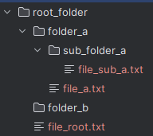
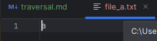
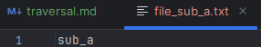
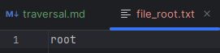
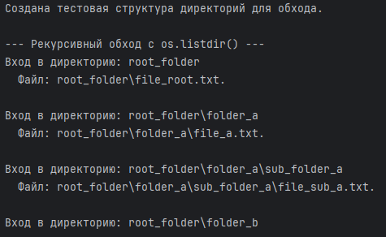
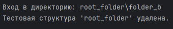
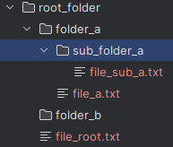
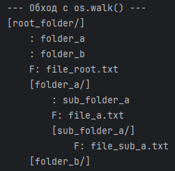
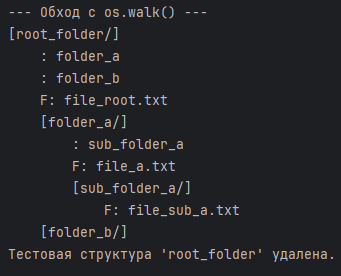

# Обход файловой системы

Обработка всех файлов/директорий в определённой структуре папок.

### [4.1 Рекурсивный обход = os.listdir()](#title0)
### [4.2 Использование c shutil = os.walk()](#title1)

## <a id="title0">Рекурсивный обход = os.listdir()</a>

### Пример
```
import os
import shutil


# Функция для обхода директорий

def list_files_recursive(path):
    print(f"Вход в директорию: {path}")
    try:
        for i in os.listdir(path):
            i_path = os.path.join(path, i)
            if os.path.isfile(i_path):
                print(f"  Файл: {i_path}.\n")
            elif os.path.isdir(i_path):
                list_files_recursive(i_path) # Рекурсивный вызов для поддиректорий
    except PermissionError:
        print(f"  Ошибка: Нет прав доступа к директории '{path}'. Пропускаем.\n")
    except Exception as e:
        print(f"  Произошла ошибка при обходе '{path}': {e}.\n")


# Создаём тестовую структуру для обхода

if not os.path.exists("root_folder"):
    os.makedirs("root_folder/folder_a/sub_folder_a")
    os.makedirs("root_folder/folder_b")
    with open("root_folder/file_root.txt", "w") as f:
        f.write("root")
    with open("root_folder/folder_a/file_a.txt", "w") as f:
        f.write("a")
    with open("root_folder/folder_a/sub_folder_a/file_sub_a.txt", "w") as f:
        f.write("sub_a")
    print("Создана тестовая структура директорий для обхода.\n")


print("--- Рекурсивный обход с os.listdir() ---")
list_files_recursive("root_folder")
```
Результат:











### Продолжение примера
```
# Удаляем

if os.path.exists("root_folder"):
    shutil.rmtree("root_folder")
    print("Тестовая структура 'root_folder' удалена.")
```
Результат:



## <a id="title1">Использование c shutil = os.walk()</a>

1. Функция os.walk() ***более удобный эффективный способ  обхода дерева директорий***.

2. Генерирует кортежи (dirpath, dirnames, filenames) для каждой директории в дереве:

    + **dirpath** = ***путь текущей директории***.

    + **dirnames** = ***список имён поддиректорий в dirpath***.

    + **filenames** = ***список имён файлов в dirpath***.

### Пример
```
import os
import shutil

# Создаём тестовую структуру для обхода

if not os.path.exists("root_folder"):
    os.makedirs("root_folder/folder_a/sub_folder_a")
    os.makedirs("root_folder/folder_b")
    with open("root_folder/file_root.txt", "w") as f:
        f.write("root")
    with open("root_folder/folder_a/file_a.txt", "w") as f:
        f.write("a")
    with open("root_folder/folder_a/sub_folder_a/file_sub_a.txt", "w") as f:
        f.write("sub_a")
    print("Создана тестовая структура директорий для обхода.\n")


print("\n--- Обход с os.walk() ---")

for root, dirs, files in os.walk("root_folder"):
    # root = current directory
    # dirs = list of names subdirectories in root
    # files = list of names files in root
    level = root.replace("root_folder", '').count(os.sep)  # Уровень вложенности для отступа
    indent = ' ' * 4 * (level)

    print(f'{indent}[{os.path.basename(root)}/]')  # Выводим текущую директорию
    subindent = ' ' * 4 * (level + 1)
    for d in dirs:
        print(f'{subindent}: {d}')  # Выводим поддиректории
    for f in files:
        print(f'{subindent}F: {f}')  # Выводим файлы
```
Результат:





### Продолжение примера
```
# Удаляем
if os.path.exists("root_folder"):
    shutil.rmtree("root_folder")
    print("Тестовая структура 'root_folder' удалена.")
```
Результат:

