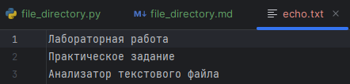
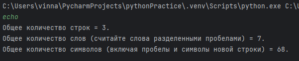
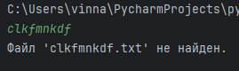

## Задание = Анализатор текстового файла

Напишите программу, которая:
1. Запрашивает у пользователя имя текстового файла.
2. Открывает этот файл для чтения.
3. Подсчитывает:
   + Общее количество строк.
   + Общее количество слов (считайте слова разделенными пробелами).
   + Общее количество символов (включая пробелы и символы новой строки).
4. Выводит эти статистики на экран.
5. Обрабатывает исключение FileNotFoundError , если указанный файл не существует.

## Решение

* with open() = конструкция, с помощью которой открываем текстовый файл. "r" = для чтения.
* encoding = для корректной работы с текстовыми файлами, особенно при наличии нелатинских символов.
* readlines() = возвращает список строк.

Далее приложен скриншот с текстовым файлом и названием.


```
file_name = input()
file_name = file_name + ".txt"

try:
    with open(file_name, "r", encoding="utf-8") as f:
        content = f.readlines()
        print(f"Общее количество строк = {len(content)}.")
        result_words = sum([len(i.split()) for i in content])
        print(f"Общее количество слов (считайте слова разделенными пробелами) = {result_words}.")
        result_symbols = sum(len(line) for line in content)
        print(f"Общее количество символов (включая пробелы и символы новой строки) = {result_symbols}.")
except FileNotFoundError:
    print(f"Файл '{file_name}' не найден.")
```
Результат:




