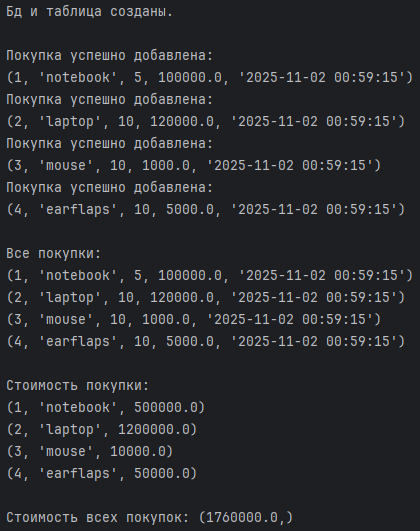

# Содержание
* ### [Задание 1](#title0)
* ### [Задание 2](#title1)

<br>

## <a id="title0">Задание 1. Система управления библиотекой</a>
 
Создайте базу данных library.db и разработайте консольное приложение для управления книгами. Приложение должно позволять:
1. Создать таблицу books : с полями id (PRIMARY KEY, AUTOINCREMENT),(TEXT, NOT NULL), author (TEXT, NOT NULL), title, year (INTEGER), isbn (TEXT, UNIQUE).
2. Добавить книгу: Запрашивает у пользователя данные о книге и вставляет их в таблицу. Обработайте ошибку, если книга с таким isbn уже существует.
3. Показать все книги: Выводит список всех книг в базе данных.
4. Найти книгу по автору или названию: Запрашивает строку поиска и выводит все книги, содержащие эту строку в названии или имени автора.
5. Обновить год издания книги: Запрашивает id книги и новый год издания, обновляет запись.
6. Удалить книгу: Запрашивает id книги и удаляет соответствующую запись.

## Решение

Делаем CRUD по заданию и то, что используем для этого:
* execute() = используется для выполнения одной команды SQL к базе данных.
+ conn.cursor() = создаёт объект курсора. Курсор = объект, который позволяет выполнять SQL-запросы.
* conn.commit() = сохраняет изменения.
+ with sqlite3.connect('library.db') as conn = устанавливает соединения с бд и автозакрытие.
* conn.rollback() = откат дл предыдущего состояния.

+ IF NOT EXISTS = предотвращает ошибку, если таблица уже существует.
* PRIMARY KEY = первичный ключ. 
+ AUTOINCREMENT = автоматически увеличивается при добавлении новой записи.
* TEXT NOT NULL = столбец текстовый, который не может быть пустым.
+ UNIQUE NOT NULL = столбец текстовый, уникальный и непустой.

* SELECT * FROM users = выборка всей таблицы (всех столбцов).
+ SELECT * FROM WHERE атрибут = ? = выборка для записи, где id = то, что передано пользователем через кортеж.

* cursor.fetchall() = возвращает все оставшиеся строки результата запроса в виде СПИСКА КОРТЕЖЕЙ.
+ cursor.fetchone() = возвращает следующую строку результата запроса в виде КОРТЕЖА или None (если строк больше нет).

1. Знаем, как реализовать методы, теперь пропишем, что в них будет происходить:
    * создание таблицы книг и бд библиотека
    * добавление книги
    * просмотр книг
    * поиск книги по году или названию, чтобы посмотреть
    * обновление года книги по id
    * удаление книги по id
2. Реализация пользователя, где вызываем соответствующие методы. Каждый метод прокомментирован.

Полный код:
```
import sqlite3
def create_table():
    with sqlite3.connect('library.db') as conn:
        cursor = conn.cursor()
        cursor.execute('''
            CREATE TABLE IF NOT EXISTS books(
                id INTEGER PRIMARY KEY AUTOINCREMENT,
                title TEXT NOT NULL,
                author TEXT NOT NULL,
                year INTEGER,
                isbn TEXT UNIQUE
            )
        ''')
        print("Таблицы 'books' успешно создана.\n")
        conn.commit()

def append_book(title, author, year, isbn):
    try:
        with sqlite3.connect('library.db') as conn:
            cursor = conn.cursor()
            cursor.execute("INSERT INTO books (title, author, year, isbn) VALUES (?, ?, ?, ?)", (title, author, year, isbn))
            conn.commit()
            print(f"Книга: {title}, {author}, {year} успешно добавлена.")
    except sqlite3.IntegrityError as e:
        print(f"Ошибка целостности данных: {e}")
        conn.rollback()

def show_books():
    with sqlite3.connect('library.db') as conn:
        cursor = conn.cursor()
        cursor.execute("SELECT * FROM books")
        print("\nВсе книги:")
        for book in cursor.fetchall():
            print(book)

def find_name_year(title, year):
    with sqlite3.connect('library.db') as conn:
        cursor = conn.cursor()
        cursor.execute("SELECT * FROM books WHERE title LIKE ? or year LIKE ?", (title, year,))  # Кортеж с 1 элементом
        print(f"\nКнига: {cursor.fetchone()}")

def update_book(id, year):
    with sqlite3.connect('library.db') as conn:
        cursor = conn.cursor()
        cursor.execute("UPDATE books SET year=? WHERE id=?", (year, id))
        print(f"Обновлено записей: {cursor.rowcount}")
        conn.commit()
        cursor.execute("SELECT * FROM books WHERE id=?", (id,))
        print(f"\nОбновленная книга: {cursor.fetchone()}")

def delete_book(id):
    with sqlite3.connect('library.db') as conn:
        cursor = conn.cursor()
        cursor.execute("DELETE FROM books WHERE id=?", (id,))
        conn.commit()
        print("\nПроверка оставшихся:")
        cursor.execute("SELECT * FROM books")
        for book in cursor.fetchall():
            print(book)

# Создаём таблицу
create_table()

# Добавляем книги
append_book("Гарри Поттер и философский камень", "Джоан Роулинг", 1997, "978-5-699-35662-1")
append_book("Гарри Поттер и тайная комната", "Джоан Роулинг", 1998, "978-5-699-35663-2")
append_book("Дюна", "Френк Герберт", 1965, "980-5-699-35662-1")
append_book("Хоббит", "Д.Р.Р. Толкин", 1937, "980-5-700-35778-3")

# Пример для исключения
append_book("Дюна 1", "Френк Герберт", 1965, "980-5-699-35662-1")

# Все книги
show_books()

# Ищем по названию или году
find_name_year("Дюна", 1965)

# Обновляем книгу
update_book(1, 1996)

# Удаляем книгу
delete_book(2)
```
Результат:


<br>

## <a id="title0">Задание 2. Журнал покупок</a>
 
Разработайте приложение для ведения журнала покупок. База данных purchases.db должна содержать таблицу transactions со следующими полями:
* transaction_id (PRIMARY KEY, AUTOINCREMENT)
* item_name (TEXT, NOT NULL)
* quantity (INTEGER, NOT NULL, > 0)
* price_per_unit (REAL, NOT NULL, > 0)
* purchase_date (TEXT, DEFAULT CURRENT_TIMESTAMP)
Приложение должно предоставлять следующие функции:
1. Записать покупку: Запрашивает название товара, количество и цену за единицу. 
Автоматически записывает текущую дату и время.
2. Показать все покупки: Выводит все записи из журнала.
3. Рассчитать общую стоимость покупок: Суммирует всех записей.
quantity * price_per_unit для 
4. Найти покупки за определенную дату: Запрашивает дату (например, 'YYYY-MM DD') и выводит все покупки, сделанные в этот день.
5. Удалить покупку по ID: Запрашивает transaction_id и удаляет запись.

## Решение

Всё делается по аналогии с предыдущим решением.
* **CHECK** = проверяем значение перед тем, как записать.
* **DEFAULT CURRENT_TIMESTAMP** = если не указали дату покупки, то заполнится датой и временем в данным момент.
* **DATE(...)** = формат YYYY-MM-DD.

Полный код:
```
import sqlite3


def append_purchase(item_name, quantity, price_per_unit):
    with sqlite3.connect('purchases.db') as connection:
        cursor = connection.cursor()
        cursor.execute("INSERT INTO transactions (item_name, quantity, price_per_unit, purchase_date) VALUES (?, ?, ?, CURRENT_TIMESTAMP)", (item_name, quantity, price_per_unit,))
        connection.commit()
        print("Покупка успешно добавлена:")
        cursor.execute("SELECT * FROM transactions WHERE item_name=?", (item_name,))
        print(cursor.fetchone())


def show():
    with sqlite3.connect('purchases.db') as connection:
        cursor = connection.cursor()
        cursor.execute("SELECT * FROM transactions")
        print("\nВсе покупки: ")
        for purchase in cursor.fetchall():
            print(purchase)


def costs_purchase():
    with sqlite3.connect('purchases.db') as connection:
        cursor = connection.cursor()
        cursor.execute("SELECT transaction_id, item_name, (quantity*price_per_unit) FROM transactions")
        print("\nCтоимость покупки: ")
        for purchase in cursor.fetchall():
            print(purchase)


def costs_purchases():
    with sqlite3.connect('purchases.db') as connection:
        cursor = connection.cursor()
        cursor.execute("SELECT SUM(quantity*price_per_unit) FROM transactions")
        print(f"\nCтоимость всех покупок: {cursor.fetchone()}")


def find(date):
    with sqlite3.connect('purchases.db') as connection:
        cursor = connection.cursor()
        cursor.execute("SELECT * FROM transactions WHERE DATE(purchase_date)=DATE(?)", (date,))
        print("\nНайденные покупки: ")
        for purchase in cursor.fetchall():
            print(purchase)


def delete(id):
    with sqlite3.connect('purchases.db') as connection:
        cursor = connection.cursor()
        cursor.execute("DELETE FROM transactions WHERE transaction_id=?", (id,))
        print(f"\nУдалили покупку.")
        connection.commit()
        print("Оставшиеся покупки:")
        cursor.execute("SELECT * FROM transactions")
        for purchase in cursor.fetchall():
            print(purchase)


# Создаём бд и таблицу
with sqlite3.connect('purchases.db') as conn:
    cursor = conn.cursor()
    cursor.execute('''
        CREATE TABLE IF NOT EXISTS transactions(
            transaction_id INTEGER PRIMARY KEY AUTOINCREMENT,
            item_name TEXT NOT NULL,
            quantity INTEGER NOT NULL CHECK(quantity > 0),
            price_per_unit REAL NOT NULL CHECK(price_per_unit > 0),
            purchase_date TEXT DEFAULT CURRENT_TIMESTAMP
        )
    ''')
    print("Бд и таблица созданы.\n")
    conn.commit()

# Записываем покупки
append_purchase("notebook", 5, 100000)
append_purchase("laptop", 10, 120000)
append_purchase("mouse", 10, 1000)
append_purchase("earflaps", 10, 5000)

# Показ всех покупок
show()

# Стоимость покупки
costs_purchase()

# Стоимость всех покупок
costs_purchases()

# Показ покупки за определенную дату
print("\n")
find(input())

# Удаляем покупку по id
delete(3)
delete(4)
```
Результат:





