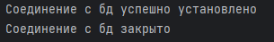
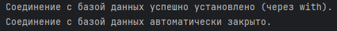
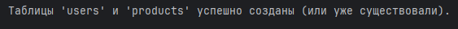
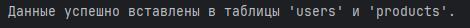
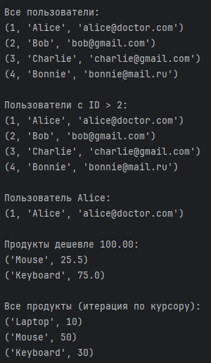
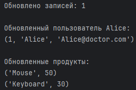
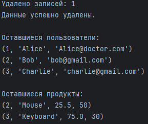
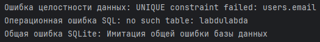

# Содержание
* ### [Основы SQLite](#title0)
* ### [Создание таблиц](#title1)
* ### [Вставка данных](#title2)
* ### [Выборка данных](#title3)
* ### [Обновление данных](#title4)
* ### [Удаление данных](#title5)
* ### [Обработка ошибок базы данных](#title6)

<br>

**SQLite** = легковесная, мощная реляционная база данных.

## <a id="title0">Основы SQLite в Python</a>

* **SQLite** = не клиент-серверная бд = встраиваемая библиотека = хранит данные в 1 файле на диске.
+ Для маленьких и средних приложений.
* Для локального хранения данных.
+ Встроенный модуль sqlite3 = представляет интерфейс для работы с бд SQLite.

### Подключение к базе данных

1. Установка соединения с бд SQLite.
2. Если бд нет, то будет создана.
3. Если есть, то будет установлено соединение к существующей бд.

* **sqlite3.connect('mydatabase.db')** = устанавливает соединения с бд.
    * Если mydatabase.db не существует, он будет создан. 
    * Если хотите создать временную базу данных в оперативной памяти, используйте ':memory:'.

+ **conn.cursor()** = создаёт объект курсора. **Курсор** = объект, который позволяет выполнять SQL-запросы.
* **conn.close()** = закрывает соединение с бд.
    * Освобождает ресурсы.
    * Все изменения будут сохранены на диск.
    * **Лучше использовать контекстный менеджер ***with*** для автоматического закрытия соединения**. 
    * То есть, если произойдут ошибки, то всё равно закроет.
```
import sqlite3

# Подключение к бд. Если файла нет, то будет создан.
# ':memory' = специальное имя для создания бд в оперативной памяти (временная бд).
conn = sqlite3.connect('mydatabase.db')

# Создание курсора (для выполнения SQL-запросов).
cursor = conn.cursor()

print("Соединение с бд успешно установлено")

# Закрытие соединения после завершения работы.
conn.close()
print("Соединение с бд закрыто")
```
Результат:



### Использование контекстного менеджера with

```
import sqlite3

# Использование with для автоматического закрытия соединения
with sqlite3.connect('mydatabase.db') as conn:
    cursor = conn.cursor()
    print("Соединение с базой данных успешно установлено (через with).")
    # Здесь можно выполнять операции с БД

print("Соединение с базой данных автоматически закрыто.")
```
Результат:



<br>

## <a id="title1">Создание таблиц</a>

После подключения к бд 1 шагом = создание таблиц для хранения данных.

+ **execute()** = используется для выполнения одной команды SQL к базе данных. 
**CREATE TABLE** = создаёт таблицы.

**IF NOT EXISTS** = предотвращает ошибку, если таблица уже существует.

**PRIMARY KEY** = первичный ключ.

**AUTOINCREMENT** = автоматически увеличивается при добавлении новой записи.

**TEXT NOT NULL** = столбец текстовый, который не может быть пустым.

**UNIQUE NOT NULL** = столбец текстовый, уникальный и непустой.

**conn.commit()** = сохраняет все изменения, сделанные с крайнего коммита или открытия соединения. Без него не будут сохранены изменения в бд.

**REAL** = тип данных, который используется для хранения чисел с плавающей запятой.

**INTEGER DEFAULT 0 в SQLite** = это определение столбца, которое означает, что он будет хранить целые числа и при вставке новой строки без указания значения для этого столбца, ему автоматически будет присвоено значение (...).
```
import sqlite3

with sqlite3.connect('mydatabase.db') as conn:
    cursor = conn.cursor()

    # SQL-запрос для создания таблицы users
    cursor.execute('''
        CREATE TABLE IF NOT EXISTS users(
            id INTEGER PRIMARY KEY AUTOINCREMENT,
            name TEXT NOT NULL,
            email TEXT UNIQUE NOT NULL
        )
    ''')

    # SQL-запрос для создания таблицы products(
    cursor.execute('''
        CREATE TABLE IF NOT EXISTS products(
            product_id INTEGER PRIMARY KEY AUTOINCREMENT,
            product_name TEXT NOT NULL,
            price REAL NOT NULL,
            stock_quantity INTEGER DEFAULT 0
        )
    ''')

    # Сохранение изменений
    conn.commit()
    print("Таблицы 'users' и 'products' успешно созданы (или уже существовали).")
```
Результат:



<br>

## <a id="title2">Вставка данных</a>

**INSERT INTO users(name, email) VALUES(?, ?)** = вставка данных. **?** = заполнители значений. Рекомендуемый способ передачи данных, так как предотвращает SQL-инъекции.
+ **cursor.execute(...)** = выполняет 1 SQL-запрос.
* **cursor.executemany(...)** = выполняет 1 и тот же SQL-запрос несколько раз с разными наборами данных. Более эффективно.

```
import sqlite3

with sqlite3.connect('mydatabase.db') as conn:
    cursor = conn.cursor()

    # Вставка 1 записи
    cursor.execute("INSERT INTO users(name, email) VALUES(?, ?), (Alice, 'alice@doctor.com')")

    # Вставка нескольких записей с помощью executemany()
    users_data = [('Bob', 'bob@gmail.com'), ('Charlie', 'charlie@gmail.com'), ('Bonnie', 'bonnie@mail.ru')]
    cursor.executemany("INSERT INTO users(name, email) VALUES (?, ?)", users_data)

    # Вставка данных в таблицу товаров
    products_data = [
        ('Laptop', 1200.00, 10),
        ('Mouse', 25.50, 50),
        ('Keyboard', 75.00, 30)
    ]
    cursor.executemany("INSERT INTO products (product_name, price, stock_quantity) VALUES(?, ?, ?)", products_data)
    conn.commit()
    print("Данные успешно вставлены в таблицы 'users' и 'products'.")
```
Результат:



<br>

## <a id="title3">Выборка данных</a>

**SELECT** = выборка данных из таблицы/таблиц.

**SELECT * FROM users** = выборка всей таблицы (всех столбцов).

**SELECT name, email FROM WHERE id > ?** = выборка столбцов name, email для записей, где id больше заданного значения.

+ **cursor.fetchall()** = возвращает все оставшиеся строки результата запроса в виде СПИСКА КОРТЕЖЕЙ.
* **cursor.fetchone()** = возвращает следующую строку результата запроса в виде КОРТЕЖА или None (если строк больше нет).

+ Можно итерировать непосредственно по объекту курсора = **for row in cursor.execute(...)**. 
    + Эффективнее с большим набором данных, так как строки извлекаются по одной, а не сразу все загружаются в память.

```
import sqlite3

with sqlite3.connect('mydatabase.db') as conn:
    cursor = conn.cursor()

    # Выборка всех записей
    cursor.execute("SELECT * FROM users")
    all_users = cursor.fetchall() # Получить все строки
    print("\nВсе пользователи:")
    for user in all_users:
        print(user)

    # Выборка записей с условием WHERE
    cursor.execute("SELECT name, email FROM users WHERE id > ?", (2,))
    selected_users = cursor.fetchall()
    print("\nПользователи с ID > 2:")
    for user in all_users:
        print(user)

    # Выборка 1 записи
    cursor.execute("SELECT * FROM users WHERE name LIKE ?", ('Alice',))
    alice = cursor.fetchone() # Получить 1 строку
    print("\nПользователь Alice:")
    print(alice)

    # Выборка данных из таблицы products
    cursor.execute("SELECT product_name, price FROM products WHERE price < ?", (100.00,))
    cheap_products = cursor.fetchall()
    print("\nПродукты дешевле 100.00:")
    for product in cheap_products:
        print(product)

    # Итерация по результатам запроса (более эффективно для больших наборов данных)
    print("\nВсе продукты (итерация по курсору):")
    for row in cursor.execute("SELECT product_name, stock_quantity FROM products"):
        print(row)
```
Результат:



<br>

## <a id="title4">Обновление данных</a>

**UPDATE таблица SET атрибут=? WHERE атрибут=?** = обновляет столбец ... для записи, у которой атрибут соответствует ? заполнителю.
* **cursor.rowcount** = атрибут курсора, который return кол-во строк, затронутых крайним INSERT, UPDATE или DELETE.

```
import sqlite3

with sqlite3.connect('mydatabase.db') as conn:
    cursor = conn.cursor()

    # Обновление записи
    cursor.execute("UPDATE users SET email=? WHERE name=?", ('Alice@doctor.com', 'Alice'))
    print(f"Обновлено записей: {cursor.rowcount}")  # Количество затронутых строк


    # Проверка обновления
    cursor.execute("SELECT * FROM users WHERE name = 'Alice'")
    print("\nОбновленный пользователь Alice:")
    print(cursor.fetchone())

    cursor.execute("SELECT product_name, stock_quantity FROM products WHERE price < 100.00")
    print("\nОбновленные продукты:")
    for product in cursor.fetchall():
        print(product)
```
Результат:



<br>

## <a id="title5">Удаление данных</a>

**DELETE FROM таблица WHERE атрибут=?** = удаляет записи из таблицы, где атрибут соответствует ? заполнителю.

```
import sqlite3

with sqlite3.connect('mydatabase.db') as conn:
    cursor = conn.cursor()

    # Удаление записи по условию
    cursor.execute("DELETE FROM users WHERE name=?", ('Bonnie',))
    print(f"Удалено записей: {cursor.rowcount}")

    # Удаление всех продуктов с количеством на складе меньше 30
    cursor.execute("DELETE FROM products WHERE stock_quantity < ?", (30,))

    conn.commit()
    print("Данные успешно удалены.")

    # Проверка оставшихся пользователей
    cursor.execute("SELECT * FROM users")
    print("\nОставшиеся пользователи:")
    for user in cursor.fetchall():
        print(user)

    # Проверка оставшихся продуктов
    cursor.execute("SELECT * FROM products")
    print("\nОставшиеся продукты:")
    for product in cursor.fetchall():
        print(product)
```
Результат:



<br>

## <a id="title6">Обработка ошибок базы данных</a>

При работе с бд могут возникать ошибки:
* нарушение уникальности ключа
* синтаксические ошибки в SQL-запросах
* ...

sqlite3 генерирует исключения, которые можно перехватить:
* **sqlite3.Error** = базовый класс для всех ошибок в модуле sqlite3.
+ **sqlite3.DatabaseError** = ошибки с бд (повреждение файла, ...).
* **sqlite3.IntegrityError** = ошибки с нарушением ограниченной целостности (вставить неуникальное значение в UNIQUE столбец).
+ **sqlite3.OperationalError** = ошибки с операциями (проблема подключения или синтаксические ошибки SQL).

**conn.rollback()** = откатывает изменения при ошибке, сделанные с момента последнего commit() или открытия соединения. 

Важно при возникновении ошибок, чтобы база данных оставалась **в согласованном состоянии**.
```
import sqlite3

with sqlite3.connect('mydatabase.db') as conn:
    cursor = conn.cursor()

    # Попытка вставить пользователя с уже существующим email (нарушение UNIQUE)
    try:
        cursor.execute("INSERT INTO users (name, email) VALUES (?, ?)", ('New User', 'bob@gmail.com'))
        conn.commit()
        print("Пользователь успешно добавлен.")
    except sqlite3.IntegrityError as e:
        print(f"Ошибка целостности данных: {e}")
        conn.rollback() # Откатываем изменения при ошибке

    # Попытка выполнить некорректный SQL-запроc
    try:
        cursor.execute("SELECT * FROM labdulabda")
        conn.commit()
    except sqlite3.OperationalError as e:
        print(f"Операционная ошибка SQL: {e}")
        conn.rollback()

    # Пример общей ошибки sqlite3.Error
    try:
        # Имитация ошибки, например, открыть повреждённую БД (повреждённый файл 'mydatabase.db')
        # Для демонстрации, мы просто вызовем ошибку вручную
        raise sqlite3.Error("Имитация общей ошибки базы данных")
    except sqlite3.Error as e:
        print(f"Общая ошибка SQLite: {e}")
        conn.rollback()
```
Результат:

