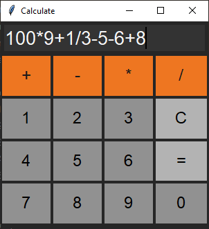
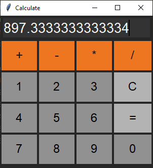
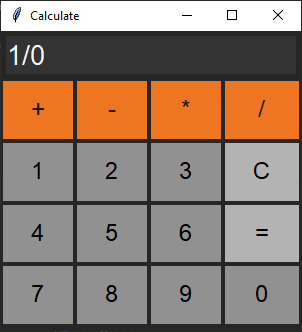
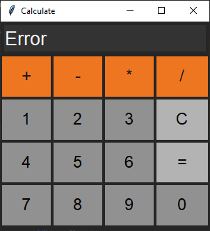
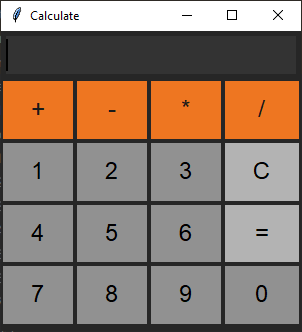
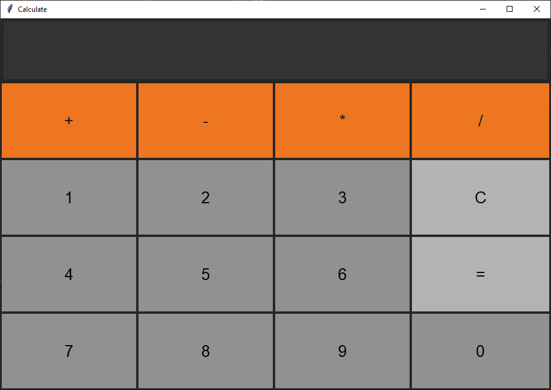
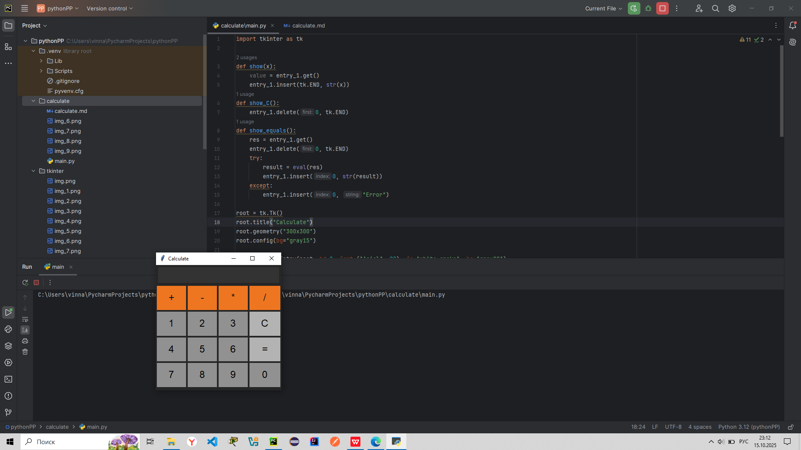

## [Калькулятор](#title0)
### [Задание](#title1)
### [Реализация](#title2)
<br>

<br>

### <a id="title1">Задание</a>

Создайте GUI-приложение, имитирующее простой калькулятор. Оно должно иметь:
1. Поле ввода ( Entry ) для отображения чисел и результатов.
2. Кнопки для цифр (0-9) и основных арифметических операций (+, -, ", /).
3. Кнопку "=" для вычисления результата.
4. Кнопку "C" для очистки поля ввода.
Используйте менеджер геометрии grid() для размещения кнопок в виде сетки.

### <a id="title2">Реализация</a>

1. Создание главного окна (контейнер виджетов) и добавим импорт библиотеки.
```
import tkinter as tk

root = tk.Tk()
root.title("Calculate")
root.geometry("300x300")
root.config(bg="gray15")
```
2. Создадим поле ввода (виджет).
```
entry_1 = tk.Entry(root, bd=0, font=("Arial", 20), fg="white smoke", bg="gray20")
entry_1.grid(row=0, column=0, columnspan=4, sticky="nsew", padx=5, pady=5)
```
3. Создадим массив значений, который вбирает в себя все элементы калькулятора.
```
buttons = ["+", "-", "*", "/", "1", "2", "3", "C", "4", "5", "6", "=", "7", "8", "9", "0"]
```
4. Создадим кнопки (виджеты) с помощью массива и доп переменных.
```
row = 1
column = 0
for i in range(len(buttons)):
    if i != 0 and i % 4 == 0:
        row += 1
        column = 0
    if i < 4:
        button = tk.Button(root, bd=0, text=buttons[i], font=('Arial', 18), fg="gray10", bg='chocolate2', command=lambda x=buttons[i]: show(x))
        button.grid(row=row, column=column, sticky="nsew", ipadx=20, ipady=5, padx=2, pady=2) # ipadx=20, ipady=5,
    else:
        if i == 7:
            button = tk.Button(root, bd=0, text=buttons[i], font=('Arial', 18), fg='black', bg='gray70', command=show_C)
            button.grid(row=row, column=column, sticky="nsew", ipadx=20, ipady=5, padx=2, pady=2)
        elif i == 11:
            button = tk.Button(root, bd=0, text=buttons[i], font=('Arial', 18), fg='black', bg='gray70',command=show_equals)
            button.grid(row=row, column=column, sticky="nsew", ipadx=20, ipady=5, padx=2, pady=2)
        else:
            button = tk.Button(root, bd=0, text=buttons[i], font=('Arial', 18), fg='black', bg='gray57', command=lambda x=buttons[i]: show(x))
            button.grid(row=row, column=column, sticky="nsew", ipadx=20, ipady=5, padx=2, pady=2)
    column += 1
```
5. С помощью менеджеров геометрии настроим окно так, чтобы все поля и кнопки уменьшались или увеличивались в зависимости от действий пользователя: 
    * если увеличили окно, то увеличились кнопки и поле ввода.
```
for i in range(5):
    root.grid_rowconfigure(i, weight=1)
for i in range(4):
    root.grid_columnconfigure(i, weight=1)
```
6. Добавим цикл событий, чтобы всё работало.
```
root.mainloop()
```
7. Создадим обработчики событий (добавим и в самое начало).
    * show(x) принимает значение, на которое нажали и вставляет в поле ввода.
    * show_C() удаляет всё из поля ввода при нажатии на C.
    * show_equals():
      * принимает значение, на которое нажали.
      * удаляет всё из поля ввода.
      * используем исключение, чтобы обработать случаи, когда арифметическая операция не может выполниться (except). Когда может выполниться - try.
      * eval() высчитывает значение из поля.
```
def show(x):
    value = entry_1.get()
    entry_1.insert(tk.END, str(x))
def show_C():
    entry_1.delete(0, tk.END)
def show_equals():
    res = entry_1.get()
    entry_1.delete(0, tk.END)
    try:
        result = eval(res)
        entry_1.insert(0, str(result))
    except:
        entry_1.insert(0, "Error")
```
8. Полный код.
```
import tkinter as tk

def show(x):
    value = entry_1.get()
    entry_1.insert(tk.END, str(x))
def show_C():
    entry_1.delete(0, tk.END)
def show_equals():
    res = entry_1.get()
    entry_1.delete(0, tk.END)
    try:
        result = eval(res)
        entry_1.insert(0, str(result))
    except:
        entry_1.insert(0, "Error")

root = tk.Tk()
root.title("Calculate")
root.geometry("300x300")
root.config(bg="gray15")

entry_1 = tk.Entry(root, bd=0, font=("Arial", 20), fg="white smoke", bg="gray20")
entry_1.grid(row=0, column=0, columnspan=4, sticky="nsew", padx=5, pady=5)

buttons = ["+", "-", "*", "/", "1", "2", "3", "C", "4", "5", "6", "=", "7", "8", "9", "0"]
row = 1
column = 0
for i in range(len(buttons)):
    if i != 0 and i % 4 == 0:
        row += 1
        column = 0
    if i < 4:
        button = tk.Button(root, bd=0, text=buttons[i], font=('Arial', 18), fg="gray10", bg='chocolate2', command=lambda x=buttons[i]: show(x))
        button.grid(row=row, column=column, sticky="nsew", ipadx=20, ipady=5, padx=2, pady=2) # ipadx=20, ipady=5,
    else:
        if i == 7:
            button = tk.Button(root, bd=0, text=buttons[i], font=('Arial', 18), fg='black', bg='gray70', command=show_C)
            button.grid(row=row, column=column, sticky="nsew", ipadx=20, ipady=5, padx=2, pady=2)
        elif i == 11:
            button = tk.Button(root, bd=0, text=buttons[i], font=('Arial', 18), fg='black', bg='gray70',command=show_equals)
            button.grid(row=row, column=column, sticky="nsew", ipadx=20, ipady=5, padx=2, pady=2)
        else:
            button = tk.Button(root, bd=0, text=buttons[i], font=('Arial', 18), fg='black', bg='gray57', command=lambda x=buttons[i]: show(x))
            button.grid(row=row, column=column, sticky="nsew", ipadx=20, ipady=5, padx=2, pady=2)
    column += 1

for i in range(5):
    root.grid_rowconfigure(i, weight=1)
for i in range(4):
    root.grid_columnconfigure(i, weight=1)

root.mainloop()
```
9. Результат программы.













