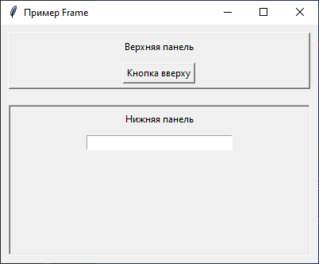

## [GUI](#title0)
## [Tkinter](#title1)
### [Пример 1: кнопка](#title2)
### [Пример 2: метка](#title3)
### [Пример 3: поле ввода](#title4)
### [Пример 4: текстовое поле](#title5)
### [Пример 5: флажки](#title6)
### [Пример 6: переключатель](#title7)
### [Пример 7: ползунок](#title8)
### [Пример 8: pack()](#title9)
### [Пример 9: grid()](#title10)
### [Пример 10: place()](#title11)
### [Пример 11: организация виджетов](#title12)

<br>
<br>
<br>

## <a id=title0>GUI</a>

* **<u>GUI</u>** - графический пользовательский интерфейс. Состоит из:
     * всплывающее окно на экране
     * значки
     * кнопки
     * меню
     * текстовое поле
     * и т.д.

* **<u>Tkinter</u>** - библиотека для реализации GUI-приложений в Python. Является кроссплатформенной.

> Отличие от консольных приложений заключается в том, что программа не выполняется последовательно, а ждёт **события**:
  > + нажатия на кнопки
  > + движение мышки
  > + и т.д.

Разработка подобных приложений называется **<u>событийно-ориентированным программированием**</u>. 

+ Подобная модель состоит из:
  
  + <u>**События/Event**</u> - действие, происходящее в системе.
    + клик мыши
    + нажатие клавиши
    + изменение размера окна
  + <u>**Источника события/Event Source**</u> - объект, который генерирует <u>событие</u>.
    + кнопка
    + текстовое поле
  + <u>**Обработчика события/Event Handler**</u> или <u>**Слушатель/Listener**</u> - функция или метод, который вызывается <u>в ответ на определенное событие</u>. 
  > Он содержит логику, которая должна быть выполнена при возникновении события. 
  
  + <u>**Цикла событий/Event Loop**</u> - основной цикл GUI-приложения, который <u>постоянно
       ожидает возникновения событий</u>, перехватывает их и передает соответствующим
       обработчикам.

<br>

## <a id=title1>Tkinter</a>

Концепции:

   + <u>**Виджеты/Widgets**</u> - это строительные блоки GUI-приложения.
     + кнопки
     + метки
     + текстовые поля
     + и т.д. 
   + Каждый виджет является ***объектом класса Tkinter***.

   * <u>**Главное окно/Root Window**</u> - основное окно приложения, ***создаваемое объектом Tk()***. 
   * Все остальные виджеты размещаются внутри этого окна или других виджетов.
   
   + <u>**Менеджеры геометрии/Geometry Managers**</u> - методы, используемые ***для размещения виджетов внутри окна***. 
   + Основные менеджеры: 
     + pack()
     + grid()
     + place()
   
   * **pack()** - упаковывает виджеты в блоки до или после других виджетов. Для простых макетов.

   + **grid()** - размещает виджеты в табличной структуре. Для сложных макетов.
   
   * **place()** - позволяет размещать виджеты по абсолютным координатам. Для точного позиционирования.
   
   + <u>**Цикл событий/mainloop()**</u> - метод, который запускает цикл обработки событий
           Tkinter. После вызова mainloop() приложение становится <u>интерактивным</u> =
           ожидает действий пользователя.

<br>

## <a id=title2>пример 1: приложение с кнопкой</a>

1. Прописываем обработчика событий. 
    * <u>**messagebox**</u> для отображения всплывающих сообщений.
```
def button_on_click():
    messagebox.showinfo("Hello", "Hello world")
```
2. Создаём источники событий - главное окно = контейнер для всех виджетов.
    * cоздание главного окна
    * текст заголовка окна
    * размер окна
```
root = tk.Tk()
root.title("Hello world app")
root.geometry("500x300")
```
3. Создание виджета - кнопка.
    * в каком окне расположим кнопку
    * что на ней написано
    * какой метод вызываем при ёё нажатии
```
button = tk.Button(root, text="Click on me", command=button_on_click) 
```
4. Размещение виджета - менеджеры геометрии.
    * используем вертикальный отступ **pady**.
```
button.pack(pady=50)
```
5. Цикл событий. 
    * приложение становится интерактивным и ожидает действий пользователя. 
    * без этого вызова окно не появится.
```
root.mainloop()
```
Полный код:
```
import tkinter as tk
from tkinter import messagebox

def button_on_click():
    messagebox.showinfo("Hello", "Hello world")

root = tk.Tk() 
root.title("Hello world app")
root.geometry("500x300")

button = tk.Button(root, text="Click on me", command=button_on_click)

button.pack(pady=50)

root.mainloop()
```
Результат:


<br>

## <a id=title3>пример 2: label (метки)</a>

* <u>**Виджет Label**</u> используется для отображения текста или изображения, которое пользователь не может редактировать.

1. Создаём главное окно
```
root = tk.Tk()
root.title("Метка")
root.geometry("500x300")
```
2. Создаём метку.
    * в каком окне расположим кнопку
    * что на ней написано
    * размер и шрифт текста
    * цвет текста
    * цвет фона
```
label = tk.Label(root, text="Текст на метке", font=("Arial", 18), fg="blue", bg="white") 
```
3. Отступ
```
label.pack(pady=20)
```
4. Цикл событий.
```
root.mainloop()
```
Полный код:
```
import tkinter as tk

root = tk.Tk()
root.title("Метка")
root.geometry("500x300")

label = tk.Label(root, text="Текст на метке", font=("Arial", 18), fg="blue", bg="white")
label.pack(pady=20)

root.mainloop()
```
Результат:


<br>

## <a id=title4>пример 3: entry - поля ввода</a>

* <u>**Виджет Entry**</u> используется для отображения однострочного ввода текста пользователем.

1. Создаём обработчик события. Всплывающее окно при нажатии на кнопку. 
   * showinfo() - ввели текст, нажали на кнопку
   * showwarning() - нажали на кнопку
   * entry.get() - получает текст из поля ввода
```
def submit_name():
 name = entry.get()
 if name:
  messagebox.showinfo("Приветствие", f"Привет, {name}!")
 else:
  messagebox.showwarning("Внимание", "Пожалуйста, введите ваше имя.")
```
2. Создаём источники событий. Главное окно.
```
root = tk.Tk()
root.title("Поле ввода")
root.geometry("500x300")
```
3. Создаём метку в окне.
```
label = tk.Label(root, text="Введите имя", font=("Arial", 18), fg="blue", bg="white") 
label.pack(pady=20)
```
4. Создаём кнопку.
```
button = tk.Button(root, text="Click on me", command=submit_name) 
button.pack(pady=10)
```
5. Цикл событий
```  
root.mainloop()
```
Полный код:
```
import tkinter as tk
from tkinter import messagebox

def submit_name():
    name = entry.get() # получает текст из поля
    if name:
        messagebox.showinfo("Hello", f"Hello, {name}")
    else:
        messagebox.showwarning("Warning", "Пожалуйста, введите имя")

root = tk.Tk()
root.title("Поле ввода")
root.geometry("500x300")

label = tk.Label(root, text="Введите имя", font=("Arial", 18), fg="blue", bg="white")
label.pack(pady=20)

entry = tk.Entry(root, width=30) # Ширина поля
entry.pack(pady=5)

button = tk.Button(root, text="Click on me", command=submit_name)
button.pack(pady=10)

root.mainloop()
```
Результат:


<br>

##  <a id="title5">пример 4: text - текстовое поле</a>

* <u>**Виджет Text**</u> используется для многострочного ввода и отображения текста. Также
    * форматирование
    * вставка изображений
    * и т.д.

1. Создаём источники событий. Главное окно.
```
root = tk.Tk()
root.tile("Полее ввода многострочного текста")
root.geometry(500x300)
```
2. Виджет Text.
    * высота
    * ширина
    * wrap="word" - перенос по словам
```
text = tk.Text(root, height=10, width=40, wrap="word")
text.pack(pady=20)
```
3. Вставка текста.
   * **tk.END** - добавить текст в конец текстового поля
```
text.insert(tk.END, "Многострочное текстовое поле")
text.insert(tk.END, "Введите текст")
```
4. Обработчик событий (метод).
   * 1.0 - с первой строки, нулевого символа
   * tk.END - до конца
```
def get_text():
 content = text.get("1.0", tk.END)
 print("Содержимое окна:")
 print(content)
```
5. Виджет кнопка.
```
button = tk.Button(root, text="Click on me", command=get_text)
button.pack(pady=5)
```
6. Цикл событий
```
root.mainloop()
```
Полный код:
```
import tkinter as tk

root = tk.Tk()
root.title("Пример Text")
root.geometry("400x300")

text = tk.Text(root, height=10, width=40, wrap="word")
text.pack(pady=20)
text.insert(tk.END, "Многострочное текстовое поле")
text.insert(tk.END, "Введите текст")

def get_text():
 content = text.get("1.0", tk.END)
 print("Содержимое окна:")
 print(content)

button = tk.Button(root, text="Click on me", command=get_text)
button.pack(pady=5)

root.mainloop()
```
Результат:


<br>

##  <a id="title6">пример 5: checkbutton - флажки</a>

* <u>**Флажки**</u> позволяют выбрать пользователю 1 из нескольких вариантов.

1. Создаём обработчик события.
    * **var.get()** = получаем состояние флажка из переменной var.
    * **join()** = объединяет список в строку, разделяя ", ".
```
def selection_options():
    selection_options = []
    if var1.get():
        selection_options.append("Вариант 1")
    if var2.get():
        selection_options.append("Вариант 2")
    if var3.get():
        selection_options.append("Вариант 3")
    if selection_options:
        print("Выбрано: ", ", ".join(selection_options))
    else:
        print("Выбирай")
```
2. Создаём источники событий. Главное окно.
```
root = tk.Tk()
root.title("Флажки")
root.geometry("500x300")
```
3. Переменные для хранения состояния флажков.
```
var1 = tk.BooleanVar()
var2 = tk.BooleanVar()
var3 = tk.BooleanVar()
```
4. Создаём флажки.
    * где расположены опции
    * текст рядом с опциями
    * какое состояние у опции
    * когда отмечен
    * когда не отмечен
```
check1 = tk.Checkbutton(root, text="Опция 1", variable=var1, onvalue=True, offvalue=False)
check2 = tk.Checkbutton(root, text="Опция 2", variable=var2, onvalue=True, offvalue=False)
check3 = tk.Checkbutton(root, text="Опция 3", variable=var3, onvalue=True, offvalue=False)
```
5. Размещение флажков.
    * **anchor='w'** = выравнивание по левому краю
    * **padx** = отступ по горизонтали
```
check1.pack(anchor='w', padx=20, pady=5)
check2.pack(anchor='w', padx=20, pady=5)
check3.pack(anchor='w', padx=20, pady=5)
```
6. Кнопка.
```
button = tk.Button(root, text="Click on me", command=selection_options)
button.pack(pady=20)
```
7. Цикл событий.
```
root.mainloop()
```
Полный код:
```
import tkinter as tk

def selection_options():
    selection_options = []
    if var1.get():
        selection_options.append("Вариант 1")
    if var2.get():
        selection_options.append("Вариант 2")
    if var3.get():
        selection_options.append("Вариант 3")
    if selection_options:
        print("Выбрано: ", ", ".join(selection_options))
    else:
        print("Выбирай")
root = tk.Tk()
root.title("Флажки")
root.geometry("500x300")

var1 = tk.BooleanVar()
var2 = tk.BooleanVar()
var3 = tk.BooleanVar()

check1 = tk.Checkbutton(root, text="Опция 1", variable=var1, onvalue=True, offvalue=False)
check2 = tk.Checkbutton(root, text="Опция 2", variable=var2, onvalue=True, offvalue=False)
check3 = tk.Checkbutton(root, text="Опция 3", variable=var3, onvalue=True, offvalue=False)

check1.pack(anchor='w', padx=20, pady=5)
check2.pack(anchor='w', padx=20, pady=5)
check3.pack(anchor='w', padx=20, pady=5)

button = tk.Button(root, text="Click on me", command=selection_options)
button.pack(pady=20)

root.mainloop()
```
Результат:


<br>

## <a id="title7">пример 6: radiobutton - переключатель</a>

* <u>**Radiobutton**</u> позволяет выбрать только 1 из набора.

1. Создаём обработчик событий.
    * seleceted_color.get() = получаем значение из переменной с цветом
```
def show_selection():
 print("Выбран цвет:", selected_color.get())
```
2. Создаём источники событий. Главное окно.
```
root = tk.Tk()
root.title("Переключатель")
root.geometry("500x300")
```
3. Создаём переменную для хранения выбранного значения и установим значение по умолчанию.
```
selected_color = tk.StringVar() 
selected_color.set("Красный")
```
4. Создаём переключатели.
    * **variable=selected_color** = общая переменная для группы переключателей.
    * **value="Красный"** = значение, которое присваивается переменной при выборе этой кнопки. 
    * **command=show_selection** = функция, которая выполняется при выборе кнопки.
```
radio1 = tk.Radiobutton(root, text="Красный", variable=selected_color, value="Красный", command=show_selection)
radio2 = tk.Radiobutton(root, text="Зеленый", variable=selected_color, value="Зеленый", command=show_selection)
radio3 = tk.Radiobutton(root, text="Синий", variable=selected_color, value="Синий", command=show_selection)
```
5. Размещение переключателей.
```
radio1.pack(anchor="w", padx=20, pady=5)
radio2.pack(anchor="w", padx=20, pady=5)
radio3.pack(anchor="w", padx=20, pady=5)
```
6. Цикл событий.
```
root.mainloop()
```
Полный код:
```
import tkinter as tk

def show_selection():
 print("Выбран цвет:", selected_color.get())

root = tk.Tk()
root.title("Переключатель")
root.geometry("500x300")

selected_color = tk.StringVar()
selected_color.set("Красный")

radio1 = tk.Radiobutton(root, text="Красный", variable=selected_color, value="Красный", command=show_selection)
radio2 = tk.Radiobutton(root, text="Зеленый", variable=selected_color, value="Зеленый", command=show_selection)
radio3 = tk.Radiobutton(root, text="Синий", variable=selected_color, value="Синий", command=show_selection)

radio1.pack(anchor="w", padx=20, pady=5)
radio2.pack(anchor="w", padx=20, pady=5)
radio3.pack(anchor="w", padx=20, pady=5)

root.mainloop()
```
Результат:


<br>

## <a id="title8">пример 7: scale - ползунок</a>

1. Создаём обработчик событий.
```
def show_value(val):
 print("Выбранное значение:", int(float(val)))
```
2. Создаём источники событий. Главное окно.
```
root = tk.Tk()
root.title("Ползунок")
root.geometry("500x300")
```
3. Создаём ползунок.
    * **from=0** = начальное значение.
    * **to=100** = конечное значение.
    * **orient=tk.HORIZONTAL** = ориентация: горизонталь или вертикаль.
    * **label**="Выберите значение:" = метка над ползунком.
    * **command=show_value** = функция, вызываемая при изменении значения.
```
scale = tk.Scale(root, from_=0, to=100, orient=tk.HORIZONTAL, label="Выберите значение:", command=show_value)
```
4. Задаём начальное значение и размещение.
```
scale.set(50)
scale.pack(pady=20)
```
5. Цикл событий.
```
root.mainloop()
```
Полный код:
```
import tkinter as tk

def show_value(val):
 print("Выбранное значение:", int(float(val)))

root = tk.Tk()
root.title("Ползунок")
root.geometry("500x300")

scale = tk.Scale(root, from_=0, to=100, orient=tk.HORIZONTAL, label="Выберите значение:", command=show_value)

scale.set(50)
scale.pack(pady=20)

root.mainloop()
```
Результат:


<br>

## <a id="title9">пример 8: менеджер геометрии - pack()</a>

* <u>**pack()**</u> = размещает виджеты в блоках : <u<1 за другим</u>. 
* полезен для вертикальных и горизонтальных макетов.
* простейший менеджер

Основные опции:
* **side** = tk.TOP (default), t.BOTTOM, tk.LEFT, tk.RIGHT.
* **fill** = растягивает виджет по указанной оси: tk.X, tk.Y, tk.BOTH, tk.None.
* **tk.expand** = позволяет виджету занимать дополнительное пространство: True/False.
* **padx, pady** = внешние отступы по горизонтали и вертикали.
* **ipadx, ipady** = внутренние отступы/internal padding внутри виджета.

1. Создаём источники событий. Главное окно.
```
root = tk.Tk()
root.title("Метод pack()")
root.geometry("500x300")
```
2. Создаём виджеты (кнопки).
```
button_one = tk.Button(root, text="Кнопка 1")
button_one.pack(pady=5)

button_two = tk.Button(root, text="Кнопка 2")
button_two.pack(pady=5)
```
Кнопки расположены друг за другом.


3. Создадим Frame для группировки кнопок (слева направо).
    * **bd** = толщина границы в пикселях.
    * **relief** = стиль рельефа границы (есть ещё: flat, raised, sunken, ridge, solid).
```
frame = tk.Frame(root, bd=2, relief="groove")
frame.pack(pady=10)
```
4. Создаём кнопки. 
    * в конструкторе, указываем вместо root, frame. 
    * в методе pack(): прописываем сторону, где расположим и отступ. 
```
button_1 = tk.Button(frame, text="Левая")
button_1.pack(side=tk.LEFT, padx=10)

button_2 = tk.Button(frame, text="Правая")
button_2.pack(side=tk.RIGHT, padx=10)
```
5. Цикл событий.
```
root.mainloop()
```
Полный код:
```
import tkinter as tk

root = tk.Tk()
root.title("Метод pack()")
root.geometry("500x300")

button_one = tk.Button(root, text="Кнопка 1")
button_one.pack(pady=5)

button_two = tk.Button(root, text="Кнопка 2")
button_two.pack(pady=5)

frame = tk.Frame(root, bd=2, relief="groove")
frame.pack(pady=10)

button_1 = tk.Button(frame, text="Левая")
button_1.pack(side=tk.LEFT, padx=10)

button_2 = tk.Button(frame, text="Правая")
button_2.pack(side=tk.RIGHT, padx=10)

root.mainloop()
```
Результат:


## <a id="title10">пример 9: менеджер геометрии - grid()</a>

* <u>**grid**</u> = размещает виджеты в табличной структуре.
* мощный и гибкий менеджер.

Основные опции:
* **row**, **column** = номер строки и столбца, где разместиться виджет (отсчёт, как в массиве).
* **rowspan**, **columnspan** = количество строк/столбцов, которое занимает виджет.
* **sticky** = прикрепляет виджет к сторонам ячейки, если ячейка больше виджета: tk.N, tk.S, tk.E, tk.W.
* **padx**, **pady**, **ipadx**, **ipady** = -//-

1. Создаём источники событий. Главное окно.
```
root = tk.Tk()
root.title("Метод grid()")
root.geometry("500x300")
```
2. Создаём метки и поля ввода.
```
label_name = tk.Label(root, text="Имя:")
entry_name = tk.Entry(root)
label_email = tk.Label(root, text="Email:")
entry_email = tk.Entry(root)
```
3. Размещаем с помощью метода grid():
```
label_name.grid(row=0, column=0, padx=5, pady=5, sticky=tk.W)
entry_name.grid(row=0,column=1,padx=5,pady=5,sticky=tk.E)
```

```
label_email.grid(row=1, column=0, padx=5, pady=5, sticky=tk.W)
entry_email.grid(row=1, column=1, padx=5, pady=5, sticky=tk.E)
```


4. Создадим кнопку "Отправить", растянем её на 2 стлолбца.
```
button = tk.Button(root, text="Отправить")
button.grid(row=2, column=0, columnspan=2, pady=10)
```


5. Растянем поля ввода под размер окна.
    * 1 = какой столбец
    * weight=1: 0 - фиксированный, 1 - растягивает поле. 
```
root.grid_columnconfigure(1, weight=1)
```
6. Цикл событий.
```
root.mainloop()
```
Полный код:
```
import tkinter as tk

root = tk.Tk()
root.title("Метод grid()")
root.geometry("500x300")

label_name = tk.Label(root, text="Имя:")
entry_name = tk.Entry(root)

label_email = tk.Label(root, text="Email:")
entry_email = tk.Entry(root)

label_name.grid(row=0, column=0, padx=5, pady=5, sticky=tk.W)
entry_name.grid(row=0,column=1,padx=5,pady=5,sticky=tk.EW)

label_email.grid(row=1, column=0, padx=5, pady=5, sticky=tk.W)
entry_email.grid(row=1, column=1, padx=5, pady=5, sticky=tk.EW)

button = tk.Button(root, text="Отправить")
button.grid(row=2, column=0, columnspan=2, pady=10)

root.grid_columnconfigure(1, weight=1)

root.mainloop()
```
Результат:


<br>

## <a id="title11">пример 10: менеджер геометрии - place()</a>

* <u>**place()**</u> = позволяет размещать виджеты по абсолютным координатам, а также относительно родительского виджета.
* полезен для точного позиционирования  наложения виджетов.

Основные опции:
* **x**, **y** = абсолютные координаты верхнего левого угла виджета.
* **relx**, **rely** = координаты относительно ширины/высоты родительского виджета (0.0-1.0).
* **width**,**height** = абсолютная ширина/высота виджета.
* **relwidth**, **relheight** = ширина/высота относительно родительского виджета (0.0-1.0).
* **anchorn** = точка привязки виджета к координатам: tk.NW, tk.CENTER, ...

1. Создаём источники событий. Главное окно.
```
root = tk.Tk()
root.title("Метод grid()")
root.geometry("500x300")
```
2. Создаём кнопки и размещаем их.
```
button_1 = tk.Button(root, text="Абсолютное позиционирование")
button_1.place(x=10,y=10)

button_2 = tk.Button(root, text="Относительное позиционирование")
button_2.place(relx=0.5, rely=0.4, anchor=tk.CENTER)
```
3. Цикл событий.
```
root.mainloop()
```
Полный код:
```
import tkinter as tk

root = tk.Tk()
root.title("Метод place()")
root.geometry("500x300")

button_1 = tk.Button(root, text="Абсолютное позиционирование")
button_1.place(x=10,y=10)

button_2 = tk.Button(root, text="Относительное позиционирование")
button_2.place(relx=0.5, rely=0.4, anchor=tk.CENTER)

root.mainloop()
```
Результат:


<br>

## <a id="title12">пример 11: организация виджетов - Frame</a>
1. Главное окно.
```
root = tk.Tk()
root.title("Пример Frame")
root.geometry("400x300")
```
2. Фреймы и их содержимое.
    * **fill=tk.X** = заполнит всё пространство по горизонтали (даже при увеличении окна).
```
top_frame = tk.Frame(root, bd=2, relief="raised")
top_frame.pack(side=tk.TOP, fill=tk.X, pady=10, padx=10)

label_top = tk.Label(top_frame, text="Верхняя панель")
label_top.pack(pady=5)
button_top = tk.Button(top_frame, text="Кнопка вверху")
button_top.pack(pady=5)

bottom_frame = tk.Frame(root, bd=2, relief="sunken")
bottom_frame.pack(side=tk.BOTTOM, fill=tk.BOTH, expand=True, pady=10, padx=10)

label_bottom = tk.Label(bottom_frame, text="Нижняя панель")
label_bottom.pack(pady=5)
entry_bottom = tk.Entry(bottom_frame, width=30)
entry_bottom.pack(pady=5)
```
3. Цикл событий.
```
root.mainloop()
```
Полный код:
```
import tkinter as tk

root = tk.Tk()
root.title("Пример Frame")
root.geometry("400x300")

top_frame = tk.Frame(root, bd=2, relief="raised")
top_frame.pack(side=tk.TOP, fill=tk.X, pady=10, padx=10)

label_top = tk.Label(top_frame, text="Верхняя панель")
label_top.pack(pady=5)
button_top = tk.Button(top_frame, text="Кнопка вверху")
button_top.pack(pady=5)

bottom_frame = tk.Frame(root, bd=2, relief="sunken")
bottom_frame.pack(side=tk.BOTTOM, fill=tk.BOTH, expand=True, pady=10, padx=10)

label_bottom = tk.Label(bottom_frame, text="Нижняя панель")
label_bottom.pack(pady=5)
entry_bottom = tk.Entry(bottom_frame, width=30)
entry_bottom.pack(pady=5)

root.mainloop()
```
Результат:

