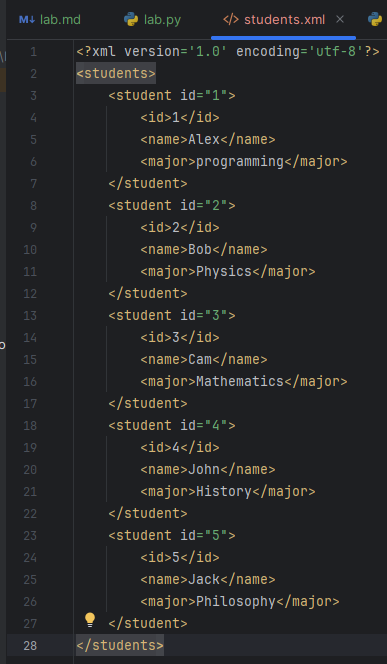

## Задание. Конвертер из CSV в XML.
Напишите программу, которая читает данные из CSV-файла и конвертирует их в XML файл. 
CSV-файл должен содержать информацию о студентах (например, id, name, major).

## Решение

1. Считываем csv файл и в переменную reader добавляем список словарей.
2. Создаём корневой элемент students.
3. Проходимся по списку словарей. Конвертируем каждую ячейку в XML, то есть создаём дочерние элементы для каждого студента и самого студента.
4. Используем ElementTree, чтобы всё сохранилось в файл.
5. Записываем в файл, кодировка utf-8 стандарт для XML, xml_declaration добавляет XML-декларацию (что это XML-документ, версия, кодировка).
Полный код:
```
import csv
import xml.etree.ElementTree as ET

try:
    with open("students.csv", "r", newline="") as f:
        reader = csv.DictReader(f)
        header = reader.fieldnames
        root = ET.Element("students")
        for i, row in enumerate(reader):
            alex = ET.SubElement(root, "student", id=f"{i + 1}")
            ET.SubElement(alex, "id").text = row["id"]
            ET.SubElement(alex, "name").text = row["name"]
            ET.SubElement(alex, "major").text = row["major"]
        tree = ET.ElementTree(root)
        tree.write("students.xml", encoding="utf-8", xml_declaration=True)
except FileNotFoundError:
    print("Добавьте файл для считывания")
```
Результат:


