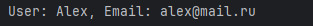
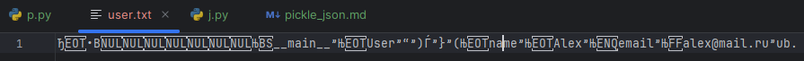
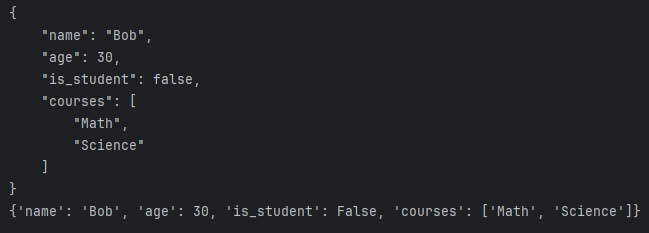
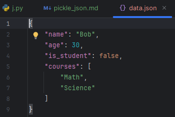

# Содержание

## [Сериализация/десериализация данных](#title0)
* ### [pickle](#title1)
* ### [json](#title2)

<br>

## <a id+"title0">Сериализация/десериализация данных</a>

**Сериализация** = ***процесс преобразования объекта Python, который можно сохранить на диск или передать по сети***.
**Десериализация** = ***обратный процесс***.

<br>

## <a id="title1">pickle</a>

**pickle** = специфичный для Python ***протокол, который может сериализовать практически любой объект Python, включая пользовательские классы***.

* Из недостоверных источников не следует десериализовывать данные - небезопасно.
* Несовместим с другими языками.

### Пример

+ **pickle.dump(user, f)** = сериализует объект user и записывает его в файл f.
* **pickle.load(f)** = десериализует объект из файла f.
+ Файлы открываем в бинарном режиме: wb, rb.

```
import pickle

class User:
    def __init__(self, name, email):
        self.name = name
        self.email = email
    def display(self):
        print(f"User: {self.name}, Email: {self.email}\n")

user = User("Alex", "alex@mail.ru")

# Сериализация (сохранение в файл)
with open("user.txt", "wb") as f:
    pickle.dump(user, f)

# Десериализация (загрузка из файла)
with open("user.txt", "rb") as f:
    loaded_user = pickle.load(f)

loaded_user.display()
```
Результат:





<br>

## <a id="title2">json</a>

**json** = JavaScript Object Notation = ***текстовый формат***, который является ***читаемым и совместим с большинством ЯП***.
* Может сериализовать только некоторый набор типов данных Python (словари, списки, строки, числа, None, False, True)

### Пример

* **json.dumps(data)** = ***сериализует объект data JSON-строку***.
+ **json.dump(data, f)** = ***сериализует объект data и записывает в файл***.
* **json.loads(json_string)** = ***десериализует строку JSON в объект Python***.
+ **json.load(f)** = ***десериализует JSON из файла f***.
* **indent=4** =  используется для красивого форматирования вывода JSON.

```
import json

# Данные для сериализации
data = {
    "name": "Bob",
    "age": 30,
    "is_student": False,
    "courses": ["Math", "Science"]
}

# Сериализация в строку
json_string = json.dumps(data, indent=4)
print(json_string)

# Сериализация в файл
with open("data.json", "w") as f:
    json.dump(data, f, indent=4)

# Десериализация из файла
with open("data.json", "r") as f:
    loaded_data = json.load(f)

print(loaded_data)
```
Результат:



