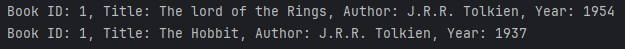
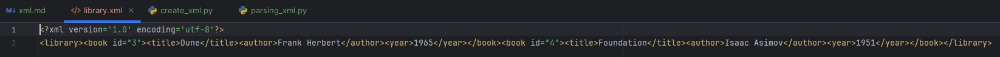

# Содержание

## [XML](#title0)
* ### [Основы](#title1)
* ### [Парсинг XML с помощью ElementTree](#title2)
* ### [Создание и модификация XML](#title3)

<br>

## <a id="title0">XML</a>

Рассмотрим:
* обработка XML-документов
* сериализация/десериализация объектов

* **XML** = **формат представления структурированных данных***.

+ **Сериализация** = ***процесс преобразование Python-объекта в поток байтов*** для ***ХРАНЕНИЯ*** и ***ПЕРЕДАЧИ***.

<br>

## <a id="title1">Основы XML</a>

**XML** = ***текстовый формат, который позволяет описывать иерархические данные с помощью тегов***.

Состоит их элементов, которые могут иметь ***атрибуты*** и содержать другие элементы.

* Каждый документ должен иметь 1 корневой элемент.

### Пример = XML-документ
```
<library>
    <book id="1">
        <title>The lord of the Rings</title>
        <author>J.R.R. Tolkien</author>
        <year>1954</year>
    </book>
    <book id="1">
        <title>The Hobbit</title>
        <author>J.R.R. Tolkien</author>
        <year>1937</year>
    </book>
</library>
```

<br>

## <a id="title2">Парсинг XML с помощью ElementTree</a>

**Парсинг** = процесс чтения XML-документа и преобразования его в древовидную структуру объектов, с который может взаимодействовать Python.

### Пример = Парсинг

* **ET.fromstring(xml_data)** = ***парсит XML из строки и return корневой элемент (<librabry>)***.
+ **root.findall('book')** = ***находит все дочерние элементы с тегом book***.
* **book.get('id')** = ***получает значение атрибута id***.
+ **book.find('title').text = ***находит первый дочерний элемент с тегом title и return текстовое содержимое***.

```
import xml.etree.ElementTree as ET

xml_data = """
<library>
    <book id="1">
        <title>The lord of the Rings</title>
        <author>J.R.R. Tolkien</author>
        <year>1954</year>
    </book>
    <book id="1">
        <title>The Hobbit</title>
        <author>J.R.R. Tolkien</author>
        <year>1937</year>
    </book>
</library>
"""

# Парсинг из строки
root = ET.fromstring(xml_data)

for book in root.findall('book'):
    book_id = book.get('id')
    title = book.find('title').text
    author = book.find('author').text
    year = book.find('year').text
    print(f"Book ID: {book_id}, Title: {title}, Author: {author}, Year: {year}")
```
Результат:



<br>

## <a id="title3">Создание и модификация XML</a>

ElementTree позволяет создавать XML-документы.

### Пример

* **ET.Element("library")** = ***создаёт новый элемент***.
+ **ET.SubElement(root, "book", "id"=3)** = ***создаёт дочерний элемент book внутри root и устанавливает атрибут id***.
* **ET.tostring(root)** = ***преобразует дерево элементов в строку***. 
+ **tree.write(...)** = ***сохраняет XML-дерево в файл***.
* **ET.ElementTree(root) = ***без него можно создавать элементы, но нельзя сохранять в файл***. Представляет ***весь XML-документ***.
    * для работы с файлами (чтение/запись).
    * для поиска по всему документу.
    * управления всем деревом элементов.
+ **xml_declaration=True** = ***добавляет XML-декларацию*** (что это XML-документ, версия, кодировка).
* **encoding='unicode' в tostring()**:
    * возвращает Python-строку (Unicode) в памяти.
    * не выполняет байтовую кодировку = символы остаются символами = return обычную Python-строку.
    * Удобно для отладки и работы внутри Python.
+ **encoding="utf-8" в write()**:
    + Выполняет кодирование в байты для записи в файл.
    + Файлы на диске всегда хранятся в байтах.
    + UTF-8 - стандартная кодировка для XML файлов.
```
import xml.etree.ElementTree as ET

# Создание корневого элемента
root = ET.Element("library")

# Создание дочерних элементов
book1 = ET.SubElement(root, "book", id="3")
ET.SubElement(book1, "title").text = "Dune"
ET.SubElement(book1, "author").text = "Frank Herbert"
ET.SubElement(book1, "year").text = "1965"

book2 = ET.SubElement(root, "book", id="4")
ET.SubElement(book2,"title").text = "Foundation"
ET.SubElement(book2, "author").text = "Isaac Asimov"
ET.SubElement(book2, "year").text = "1951"

# Преобразование в строку
xml_string = ET.tostring(root, encoding='unicode')
print(xml_string)

# Сохранение в файл
tree = ET.ElementTree(root)
tree.write("library.xml", encoding="utf-8", xml_declaration=True)
```
Результат:


